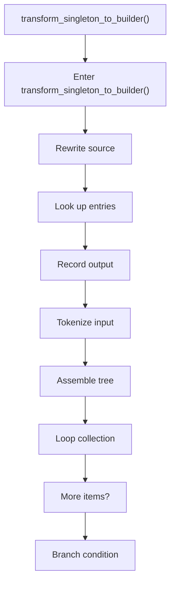
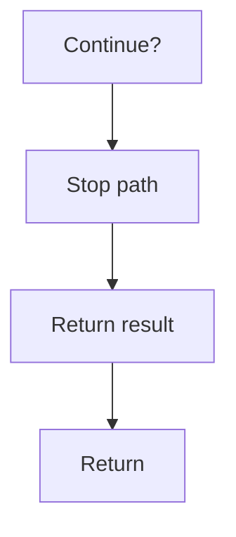

# transform_singleton_to_builder.cpp

- Source document: [creational_transform_rules.cpp.md](../../creational_transform_rules.cpp.md)
- Purpose: decoupled implementation logic for a future code unit.

### transform_singleton_to_builder()
This routine owns one focused piece of the file's behavior. It appears near line 402.

Inside the body, it mainly handles rewrite source text or model state, look up entries in previously collected maps or sets, record derived output into collections, and parse or tokenize input text.

The implementation iterates over a collection or repeated workload. It branches on runtime conditions instead of following one fixed path. The caller receives a computed result or status from this step.

What it does:
- rewrite source text or model state
- look up entries in previously collected maps or sets
- record derived output into collections
- parse or tokenize input text
- assemble tree or artifact structures
- iterate over the active collection
- branch on runtime conditions

Flow:

### Block 8 - transform_singleton_to_builder() Details
#### Part 1

#### Part 2

