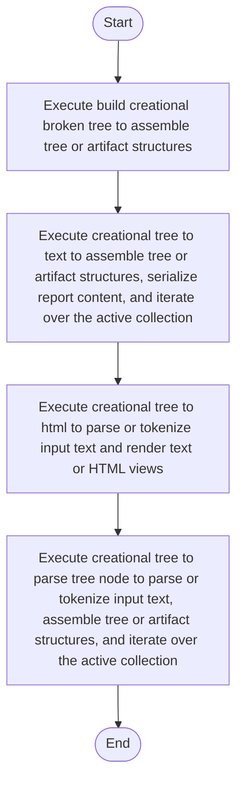

# creational_broken_tree.cpp

- Source: Microservice/Modules/Source/Creational/creational_broken_tree.cpp
- Kind: C++ implementation
- Lines: 143
- Role: Implements creational pattern detection over the generic parse tree.
- Chronology: Runs after the generic parse tree exists so creational detection or transformation can operate on it.

## Notable Symbols
- FactoryPatternDetector
- SingletonPatternDetector
- BuilderPatternDetector
- DefaultCreationalTreeCreator
- detect
- build_factory_pattern_tree
- build_singleton_pattern_tree
- build_builder_pattern_tree
- create
- build_creational_broken_tree
- creational_tree_to_parse_tree_node
- creational_tree_to_html

## Direct Dependencies
- creational_broken_tree.hpp
- Builder/builder_pattern_logic.hpp
- Factory/factory_pattern_logic.hpp
- Singleton/singleton_pattern_logic.hpp
- Output-and-Rendering/tree_html_renderer.hpp
- functional
- sstream
- string
- utility
- vector

## File Outline
### Responsibility

This source file implements creational-pattern analysis over the generic parse tree. It inspects parsed structure, applies pattern-specific rules, and emits detector results that later appear in the creational tree or transform decisions.

### Position In The Flow

Runs after the generic parse tree exists so creational detection or transformation can operate on it.

### Main Surface Area

Implements creational pattern detection over the generic parse tree. The main surface area is easiest to track through symbols such as FactoryPatternDetector, SingletonPatternDetector, BuilderPatternDetector, and DefaultCreationalTreeCreator. It collaborates directly with creational_broken_tree.hpp, Builder/builder_pattern_logic.hpp, Factory/factory_pattern_logic.hpp, and Singleton/singleton_pattern_logic.hpp.

## File Activity


## Function Walkthrough

### build_creational_broken_tree
This routine assembles a larger structure from the inputs it receives. It appears near line 74.

Inside the body, it mainly handles assemble tree or artifact structures.

The caller receives a computed result or status from this step.

Key operations:
- assemble tree or artifact structures

Activity:
```mermaid
flowchart TD
    Start([build_creational_broken_tree()])
    N0[Enter build_creational_broken_tree()]
    N1[Assemble tree or artifact structures]
    N2[Return the result to the caller]
    End([Return])
    Start --> N0
    N0 --> N1
    N1 --> N2
    N2 --> End
```

### creational_tree_to_parse_tree_node
This routine owns one focused piece of the file's behavior. It appears near line 98.

Inside the body, it mainly handles parse or tokenize input text, assemble tree or artifact structures, and iterate over the active collection.

The implementation iterates over a collection or repeated workload. The caller receives a computed result or status from this step.

Key operations:
- parse or tokenize input text
- assemble tree or artifact structures
- iterate over the active collection

Activity:
```mermaid
flowchart TD
    Start([creational_tree_to_parse_tree_node()])
    N0[Enter creational_tree_to_parse_tree_node()]
    N1[Parse or tokenize input text]
    N2[Assemble tree or artifact structures]
    N3[Iterate over the active collection]
    N4[Return the result to the caller]
    End([Return])
    Start --> N0
    N0 --> N1
    N1 --> N2
    N2 --> N3
    N3 --> N4
    N4 --> End
```

### creational_tree_to_html
This routine owns one focused piece of the file's behavior. It appears near line 112.

Inside the body, it mainly handles parse or tokenize input text and render text or HTML views.

The caller receives a computed result or status from this step.

Key operations:
- parse or tokenize input text
- render text or HTML views

Activity:
```mermaid
flowchart TD
    Start([creational_tree_to_html()])
    N0[Enter creational_tree_to_html()]
    N1[Parse or tokenize input text]
    N2[Render text or HTML views]
    N3[Return the result to the caller]
    End([Return])
    Start --> N0
    N0 --> N1
    N1 --> N2
    N2 --> N3
    N3 --> End
```

### creational_tree_to_text
This routine owns one focused piece of the file's behavior. It appears near line 121.

Inside the body, it mainly handles assemble tree or artifact structures, serialize report content, iterate over the active collection, and branch on runtime conditions.

The implementation iterates over a collection or repeated workload. It branches on runtime conditions instead of following one fixed path. The caller receives a computed result or status from this step.

Key operations:
- assemble tree or artifact structures
- serialize report content
- iterate over the active collection
- branch on runtime conditions

Activity:
```mermaid
flowchart TD
    Start([creational_tree_to_text()])
    N0[Enter creational_tree_to_text()]
    N1[Assemble tree or artifact structures]
    N2[Serialize report content]
    N3[Iterate over the active collection]
    N4[Branch on runtime conditions]
    N5[Return the result to the caller]
    End([Return])
    Start --> N0
    N0 --> N1
    N1 --> N2
    N2 --> N3
    N3 --> N4
    N4 --> N5
    N5 --> End
```

## Documentation Note
- This markdown file is part of the generated docs/Codebase mirror.
- It was generated from the repository state on 2026-04-23 after reading the existing docs corpus and the current source tree.

