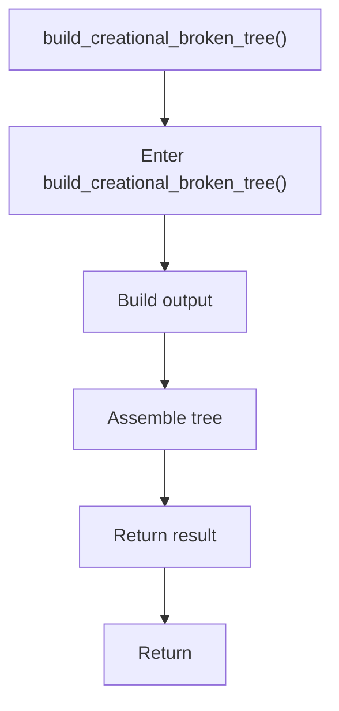

# build_creational_broken_tree.cpp

- Source document: [creational_broken_tree.cpp.md](../../creational_broken_tree.cpp.md)
- Purpose: decoupled implementation logic for a future code unit.

### build_creational_broken_tree()
This routine assembles a larger structure from the inputs it receives. It appears near line 74.

Inside the body, it mainly handles build or append the next output structure and assemble tree or artifact structures.

The caller receives a computed result or status from this step.

What it does:
- build or append the next output structure
- assemble tree or artifact structures

Flow:

