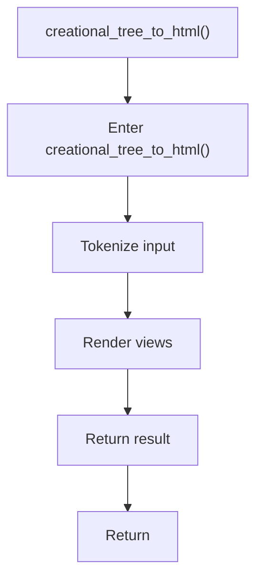

# creational_tree_to_html.cpp

- Source document: [creational_broken_tree.cpp.md](../../creational_broken_tree.cpp.md)
- Purpose: decoupled implementation logic for a future code unit.

### creational_tree_to_html()
This routine owns one focused piece of the file's behavior. It appears near line 112.

Inside the body, it mainly handles parse or tokenize input text and render text or HTML views.

The caller receives a computed result or status from this step.

What it does:
- parse or tokenize input text
- render text or HTML views

Flow:

