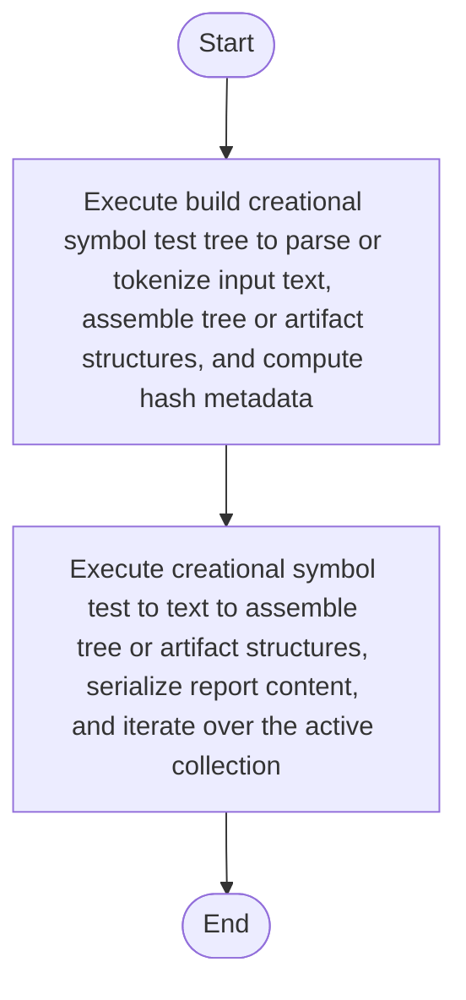

# creational_symbol_test.cpp

- Source: Microservice/Modules/Source/Creational/creational_symbol_test.cpp
- Kind: C++ implementation
- Lines: 55
- Role: Implements creational pattern detection over the generic parse tree.
- Chronology: Runs after the generic parse tree exists so creational detection or transformation can operate on it.

## Notable Symbols
- build_creational_symbol_test_tree
- creational_symbol_test_to_text
- std::string

## Direct Dependencies
- creational_symbol_test.hpp
- parse_tree_symbols.hpp
- functional
- sstream
- string

## Implementation Story
This source file implements creational-pattern analysis over the generic parse tree. It inspects parsed structure, applies pattern-specific rules, and emits detector results that later appear in the creational tree or transform decisions. Implements creational pattern detection over the generic parse tree. Runs after the generic parse tree exists so creational detection or transformation can operate on it. The implementation surface is easiest to recognize through symbols such as build_creational_symbol_test_tree, creational_symbol_test_to_text, and std::string. In practice it collaborates directly with creational_symbol_test.hpp, parse_tree_symbols.hpp, functional, and sstream.

## Activity Diagram

## Documentation Note
- This markdown file is part of the generated docs/Codebase mirror.
- It was generated from the repository state on 2026-04-22 after reading the existing docs corpus and the current source tree.

