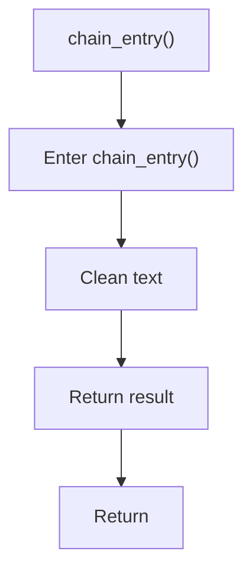

# chain_entry.cpp

- Source document: [hash_links_common.cpp.md](../../hash_links_common.cpp.md)
- Purpose: decoupled implementation logic for a future code unit.

### chain_entry()
This routine owns one focused piece of the file's behavior. It appears near line 98.

Inside the body, it mainly handles normalize raw text before later parsing.

The caller receives a computed result or status from this step.

What it does:
- normalize raw text before later parsing

Flow:

