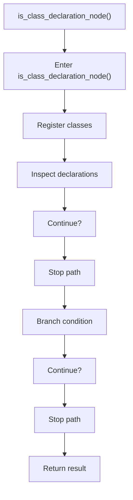

# is_class_declaration_node.cpp

- Source document: [hash_links_common.cpp.md](../../hash_links_common.cpp.md)
- Purpose: decoupled implementation logic for a future code unit.

### is_class_declaration_node()
This routine owns one focused piece of the file's behavior. It appears near line 83.

Inside the body, it mainly handles inspect or register class-level information, inspect or rewrite declarations, and branch on runtime conditions.

It branches on runtime conditions instead of following one fixed path. The caller receives a computed result or status from this step.

What it does:
- inspect or register class-level information
- inspect or rewrite declarations
- branch on runtime conditions

Flow:

### Block 4 - is_class_declaration_node() Details
#### Slice 1 - Opening Intent
Quick summary: This slice shows the opening intent of is_class_declaration_node.cpp and the first major actions that frame the rest of the flow.
Why this is separate: is_class_declaration_node.cpp has multiple branches, loops, or stage changes, so this section is split out to keep one major intent visible at a time instead of forcing one oversized diagram.

#### Slice 2 - Early Branches
Quick summary: This slice covers the first branch-heavy continuation of is_class_declaration_node.cpp after the opening path has been established.
Why this is separate: is_class_declaration_node.cpp has multiple branches, loops, or stage changes, so this section is split out to keep one major intent visible at a time instead of forcing one oversized diagram.

