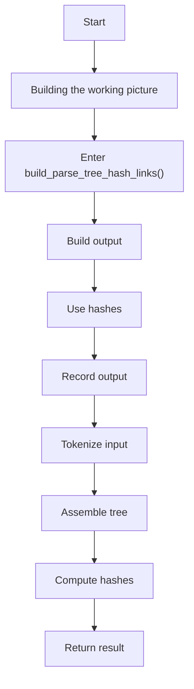
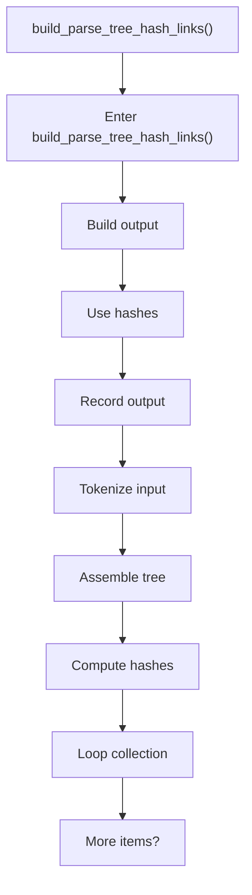
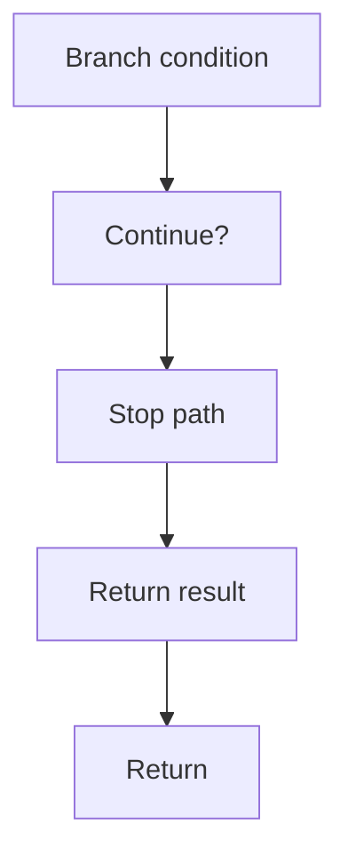

# hash_links.cpp

- Source: Microservice/Modules/Source/ParseTree/hash_links.cpp
- Kind: C++ implementation
- Lines: 141

## Story
### What Happens Here

This source file implements one internal part of the generic parse-tree engine. It contributes specialized behavior such as dependency handling, symbolization, hash-link construction, rendering, or older generation helpers after the raw tree exists. This source file implements one of the generic middle-stage services in the C++ pipeline. It is executed after sources are loaded and before the final report and rendered outputs are written.

### Why It Matters In The Flow

Runs across the middle of the microservice flow to build parse trees, hash links, symbol tables, documentation tags, reports, and rendered outputs.

### What To Watch While Reading

Implements parsing, shadow-tree building, symbolization, hash linking, rendering, and reporting. The main surface area is easiest to track through symbols such as build_parse_tree_hash_links. It collaborates directly with parse_tree_hash_links.hpp, Internal/parse_tree_hash_links_internal.hpp, string, and unordered_set.

## Program Flow
This diagram follows the action path in plain words. Decision diamonds show where the file can stop, branch, or repeat work instead of simply passing through a straight line.

The flow is intentionally split into smaller slices so the major intent of hash_links.cpp stays readable. Each slice names the stage it is covering, gives a quick summary, and explains why that stage is separated from the next one.

### Program Flow Slices
#### Slice 1 - Opening Intent
Quick summary: This slice shows the opening intent of hash_links.cpp and the first major actions that frame the rest of the flow.
Why this is separate: hash_links.cpp has multiple branches, loops, or stage changes, so this section is split out to keep one major intent visible at a time instead of forcing one oversized diagram.

#### Slice 2 - Early Branches
Quick summary: This slice covers the first branch-heavy continuation of hash_links.cpp after the opening path has been established.
Why this is separate: hash_links.cpp has multiple branches, loops, or stage changes, so this section is split out to keep one major intent visible at a time instead of forcing one oversized diagram.

## Reading Map
Read this file as: Implements parsing, shadow-tree building, symbolization, hash linking, rendering, and reporting.

Where it sits in the run: Runs across the middle of the microservice flow to build parse trees, hash links, symbol tables, documentation tags, reports, and rendered outputs.

Names worth recognizing while reading: build_parse_tree_hash_links.

It leans on nearby contracts or tools such as parse_tree_hash_links.hpp, Internal/parse_tree_hash_links_internal.hpp, string, unordered_set, utility, and vector.

## Story Groups

### Building The Working Picture
These steps assemble the trees, models, or bundles used by the rest of the file.
- build_parse_tree_hash_links() (line 9): Build or append the next output structure, compute or reuse hash-oriented identifiers, and record derived output into collections

## Function Stories

### build_parse_tree_hash_links()
This routine assembles a larger structure from the inputs it receives. It appears near line 9.

Inside the body, it mainly handles build or append the next output structure, compute or reuse hash-oriented identifiers, record derived output into collections, and parse or tokenize input text.

The implementation iterates over a collection or repeated workload. It branches on runtime conditions instead of following one fixed path. The caller receives a computed result or status from this step.

What it does:
- build or append the next output structure
- compute or reuse hash-oriented identifiers
- record derived output into collections
- parse or tokenize input text
- assemble tree or artifact structures
- compute hash metadata
- iterate over the active collection
- branch on runtime conditions

Flow:

### Block 2 - build_parse_tree_hash_links() Details
#### Slice 1 - Opening Intent
Quick summary: This slice shows the opening intent of hash_links.cpp and the first major actions that frame the rest of the flow.
Why this is separate: hash_links.cpp has multiple branches, loops, or stage changes, so this section is split out to keep one major intent visible at a time instead of forcing one oversized diagram.

#### Slice 2 - Early Branches
Quick summary: This slice covers the first branch-heavy continuation of hash_links.cpp after the opening path has been established.
Why this is separate: hash_links.cpp has multiple branches, loops, or stage changes, so this section is split out to keep one major intent visible at a time instead of forcing one oversized diagram.

## Documentation Note
- This markdown file is part of the generated docs/Codebase mirror.
- It was generated from the repository state on 2026-04-23 after reading the existing docs corpus and the current source tree.

