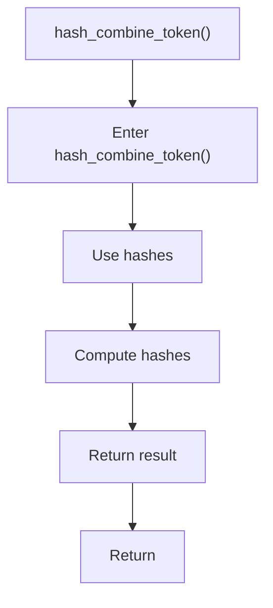

# hash_combine_token.cpp

- Source document: [hash.cpp.md](../../hash.cpp.md)
- Purpose: decoupled implementation logic for a future code unit.

### hash_combine_token()
This routine owns one focused piece of the file's behavior. It appears near line 12.

Inside the body, it mainly handles compute or reuse hash-oriented identifiers and compute hash metadata.

The caller receives a computed result or status from this step.

What it does:
- compute or reuse hash-oriented identifiers
- compute hash metadata

Flow:

