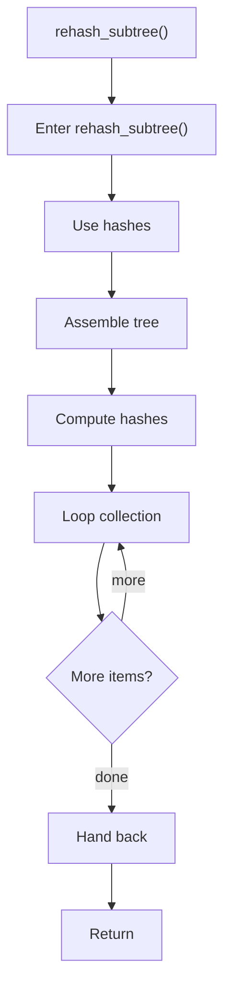

# rehash_subtree.cpp

- Source document: [hash.cpp.md](../../hash.cpp.md)
- Purpose: decoupled implementation logic for a future code unit.

### rehash_subtree()
This routine owns one focused piece of the file's behavior. It appears near line 52.

Inside the body, it mainly handles compute or reuse hash-oriented identifiers, assemble tree or artifact structures, compute hash metadata, and iterate over the active collection.

The implementation iterates over a collection or repeated workload.

What it does:
- compute or reuse hash-oriented identifiers
- assemble tree or artifact structures
- compute hash metadata
- iterate over the active collection

Flow:

