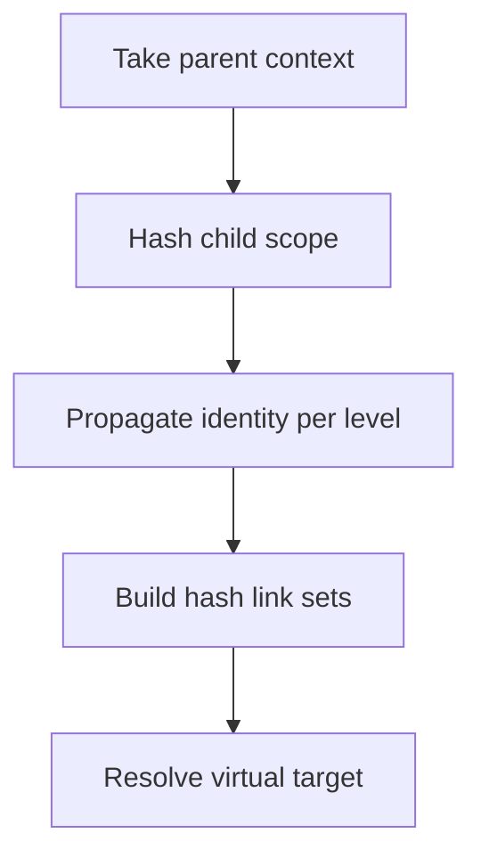

# `core.cpp`

- Folder: `docs/Codebase/Microservice/Modules/Source/HashingMechanism`
- Role: stage-wide workflow for propagated identity and hash-guided resolution

## Start Here
- Read this file first for the hash-stage workflow.
- Then read `ReverseMerkle/` and `HashLinks/`.

## Quick Summary
- This stage gives tree and usage nodes a context-aware identity.
- It uses parent-propagated hashing first, then uses hash links to reconnect actual code usage with the correct virtual or shadow target.

## Why This Stage Is Separate
- `Trees/` creates the tree shapes.
- `HashingMechanism/` makes those shapes traceable across scopes and transformed views.
- `Diffing/` requests scoped hash refresh after partial subtree regeneration.
- `OutputGeneration/` consumes the resolved bundle after identity and lookup are stable.

## Major Workflow

## Handoff
- Receives tree forms from `../Trees/core.cpp.md`.
- Hands resolved identities and lookup outputs to `../OutputGeneration/core.cpp.md`.
- Serves `../Diffing/core.cpp.md` when affected subtree hashes and dependent ancestor hashes need recalculation.

## Local Ownership
- `ReverseMerkle/` owns cascading identity construction.
- `HashLinks/` owns lookup chains and node reconnection.

## Acceptance Checks
- Cascading hash identity is documented before lookup.
- Hash-link lookup stays separate from tree generation.
- The stage can be read as one whole workflow before dropping into subfolders.
