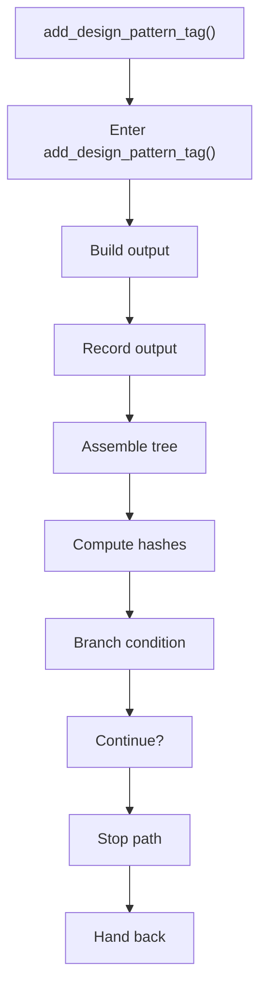

# add_design_pattern_tag.cpp

- Source document: [algorithm_pipeline.cpp.md](../../algorithm_pipeline.cpp.md)
- Purpose: decoupled implementation logic for a future code unit.

### add_design_pattern_tag()
This routine owns one focused piece of the file's behavior. It appears near line 317.

Inside the body, it mainly handles build or append the next output structure, record derived output into collections, assemble tree or artifact structures, and compute hash metadata.

It branches on runtime conditions instead of following one fixed path.

What it does:
- build or append the next output structure
- record derived output into collections
- assemble tree or artifact structures
- compute hash metadata
- branch on runtime conditions

Flow:

### Block 5 - add_design_pattern_tag() Details
#### Slice 1 - Opening Intent
Quick summary: This slice shows the opening intent of add_design_pattern_tag.cpp and the first major actions that frame the rest of the flow.
Why this is separate: add_design_pattern_tag.cpp has multiple branches, loops, or stage changes, so this section is split out to keep one major intent visible at a time instead of forcing one oversized diagram.

#### Slice 2 - Early Branches
Quick summary: This slice covers the first branch-heavy continuation of add_design_pattern_tag.cpp after the opening path has been established.
Why this is separate: add_design_pattern_tag.cpp has multiple branches, loops, or stage changes, so this section is split out to keep one major intent visible at a time instead of forcing one oversized diagram.

