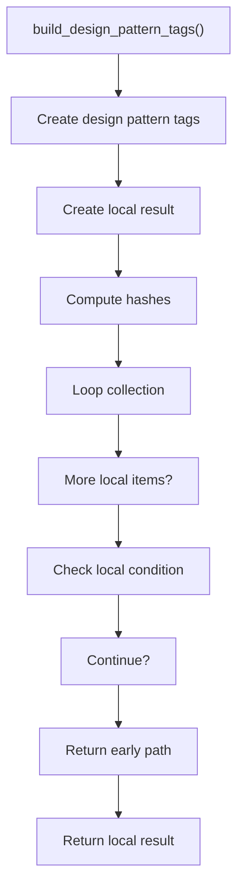
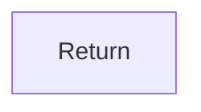

# build_design_pattern_tags.cpp

- Source document: [algorithm_pipeline.cpp.md](../../algorithm_pipeline.cpp.md)
- Purpose: decoupled implementation logic for a future code unit.

### build_design_pattern_tags()
This routine assembles a larger structure from the inputs it receives.

Inside the body, it mainly handles Create the local output structure, compute hash metadata, walk the local collection, and branch on local conditions.

The implementation iterates over a collection or repeated workload. It branches on runtime conditions instead of following one fixed path. The caller receives a computed result or status from this step.

What it does:
- Create the local output structure
- compute hash metadata
- walk the local collection
- branch on local conditions

Flow:

### Block 6 - build_design_pattern_tags() Details
#### Slice 1 - Establish Local Entry
Quick summary: This slice shows the first file-local stage for build_design_pattern_tags.cpp and keeps the diagram scoped to this code unit.
Why this is separate: build_design_pattern_tags.cpp has multiple branches, loops, or stage changes, so this section is split out to keep one major intent visible at a time instead of forcing one oversized diagram.

#### Slice 2 - Handle Early Decisions
Quick summary: This slice shows the first local decision path for build_design_pattern_tags.cpp after setup.
Why this is separate: build_design_pattern_tags.cpp has multiple branches, loops, or stage changes, so this section is split out to keep one major intent visible at a time instead of forcing one oversized diagram.

