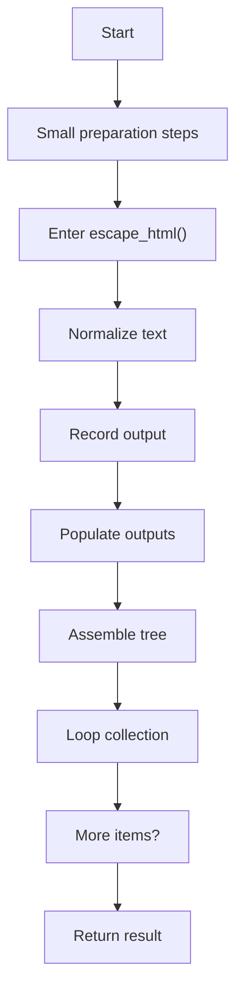
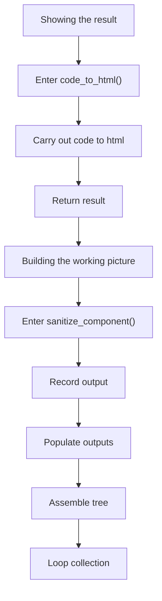
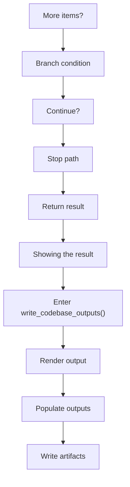
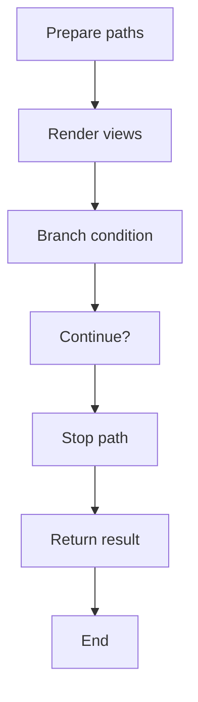
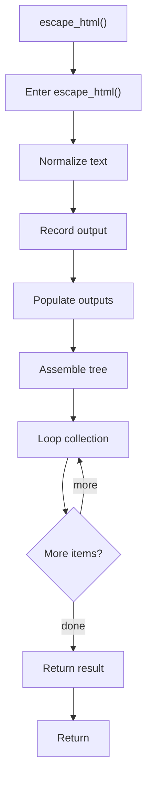
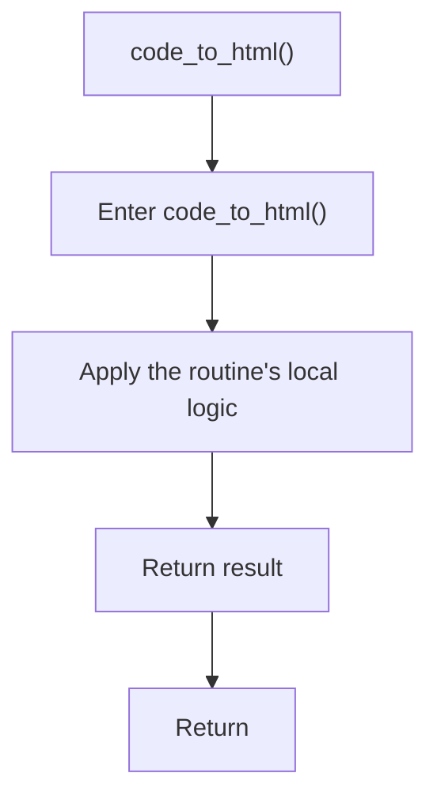
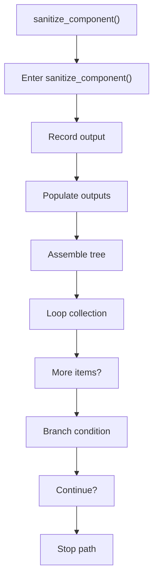
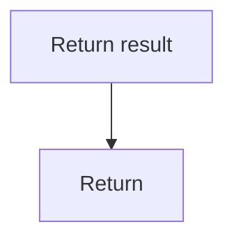
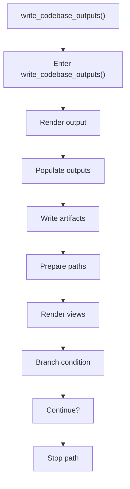

# codebase_output_writer.cpp

- Source: Microservice/Modules/Source/Output-and-Rendering/codebase_output_writer.cpp
- Kind: C++ implementation
- Lines: 118

## Story
### What Happens Here

This file keeps the older generated-code writer in one place. The current runtime path does not call it; it remains separate so output-writing behavior can be reviewed without mixing it into the tagging pipeline. This source file implements one of the generic middle-stage services in the C++ pipeline. It is executed after sources are loaded and before the final report and rendered outputs are written.

### Why It Matters In The Flow

Runs across the middle of the microservice flow to build parse trees, hash links, symbol tables, documentation tags, reports, and rendered outputs.

### What To Watch While Reading

Keeps the older generated-code writer isolated from the current tagging-focused runtime path. The main surface area is easiest to track through symbols such as escape_html, code_to_html, sanitize_component, and write_codebase_outputs. It collaborates directly with Output-and-Rendering/codebase_output_writer.hpp, filesystem, fstream, and cctype.

## Program Flow
This diagram follows the action path in plain words. Decision diamonds show where the file can stop, branch, or repeat work instead of simply passing through a straight line.

The flow is intentionally split into smaller slices so the major intent of codebase_output_writer.cpp stays readable. Each slice names the stage it is covering, gives a quick summary, and explains why that stage is separated from the next one.

### Program Flow Slices
#### Slice 1 - Opening Intent
Quick summary: This slice shows the opening intent of codebase_output_writer.cpp and the first major actions that frame the rest of the flow.
Why this is separate: codebase_output_writer.cpp has multiple branches, loops, or stage changes, so this section is split out to keep one major intent visible at a time instead of forcing one oversized diagram.

#### Slice 2 - Early Branches
Quick summary: This slice covers the first branch-heavy continuation of codebase_output_writer.cpp after the opening path has been established.
Why this is separate: codebase_output_writer.cpp has multiple branches, loops, or stage changes, so this section is split out to keep one major intent visible at a time instead of forcing one oversized diagram.

#### Slice 3 - Mid-Flow Handoff
Quick summary: This slice captures the mid-flow handoff in codebase_output_writer.cpp where preparation turns into deeper processing.
Why this is separate: codebase_output_writer.cpp has multiple branches, loops, or stage changes, so this section is split out to keep one major intent visible at a time instead of forcing one oversized diagram.

#### Slice 4 - Secondary Decision Path
Quick summary: This slice focuses on the next decision path in codebase_output_writer.cpp and the outcomes that follow from it.
Why this is separate: codebase_output_writer.cpp has multiple branches, loops, or stage changes, so this section is split out to keep one major intent visible at a time instead of forcing one oversized diagram.

## Reading Map
Read this file as: Keeps the older generated-code writer isolated from the current tagging-focused runtime path.

Where it sits in the run: Runs across the middle of the microservice flow to build parse trees, hash links, symbol tables, documentation tags, reports, and rendered outputs.

Names worth recognizing while reading: escape_html, code_to_html, sanitize_component, write_codebase_outputs, base_cpp, and target_cpp.

It leans on nearby contracts or tools such as Output-and-Rendering/codebase_output_writer.hpp, filesystem, fstream, cctype, and string.

## Story Groups

### Small Preparation Steps
These steps clean up names, text, or small values before the larger work begins.
- escape_html() (line 10): Normalize or format text values, record derived output into collections, and populate output fields or accumulators

### Building The Working Picture
These steps assemble the trees, models, or bundles used by the rest of the file.
- sanitize_component() (line 45): Record derived output into collections, populate output fields or accumulators, and assemble tree or artifact structures

### Showing The Result
These steps turn internal state into text, HTML, JSON, or another output a reader can inspect.
- code_to_html() (line 30): Owns a focused local responsibility.
- write_codebase_outputs() (line 72): Render or serialize the result, populate output fields or accumulators, and write generated artifacts

## Function Stories

### escape_html()
This helper reshapes small pieces of data so the surrounding code can stay readable. It appears near line 10.

Inside the body, it mainly handles normalize or format text values, record derived output into collections, populate output fields or accumulators, and assemble tree or artifact structures.

The implementation iterates over a collection or repeated workload. The caller receives a computed result or status from this step.

What it does:
- normalize or format text values
- record derived output into collections
- populate output fields or accumulators
- assemble tree or artifact structures
- iterate over the active collection

Flow:

### code_to_html()
This routine owns one focused piece of the file's behavior. It appears near line 30.

The caller receives a computed result or status from this step.

What it does:
- This routine is primarily structural and does not expose obvious runtime operations from static inspection.

Flow:

### sanitize_component()
This routine owns one focused piece of the file's behavior. It appears near line 45.

Inside the body, it mainly handles record derived output into collections, populate output fields or accumulators, assemble tree or artifact structures, and iterate over the active collection.

The implementation iterates over a collection or repeated workload. It branches on runtime conditions instead of following one fixed path. The caller receives a computed result or status from this step.

What it does:
- record derived output into collections
- populate output fields or accumulators
- assemble tree or artifact structures
- iterate over the active collection
- branch on runtime conditions

Flow:

### Block 2 - sanitize_component() Details
#### Slice 1 - Opening Intent
Quick summary: This slice shows the opening intent of codebase_output_writer.cpp and the first major actions that frame the rest of the flow.
Why this is separate: codebase_output_writer.cpp has multiple branches, loops, or stage changes, so this section is split out to keep one major intent visible at a time instead of forcing one oversized diagram.

#### Slice 2 - Early Branches
Quick summary: This slice covers the first branch-heavy continuation of codebase_output_writer.cpp after the opening path has been established.
Why this is separate: codebase_output_writer.cpp has multiple branches, loops, or stage changes, so this section is split out to keep one major intent visible at a time instead of forcing one oversized diagram.

### write_codebase_outputs()
This routine materializes internal state into an output format that later stages can consume. It appears near line 72.

Inside the body, it mainly handles render or serialize the result, populate output fields or accumulators, write generated artifacts, and inspect or prepare filesystem paths.

It branches on runtime conditions instead of following one fixed path. The caller receives a computed result or status from this step.

What it does:
- render or serialize the result
- populate output fields or accumulators
- write generated artifacts
- inspect or prepare filesystem paths
- render text or HTML views
- branch on runtime conditions

Flow:

### Block 3 - write_codebase_outputs() Details
#### Slice 1 - Opening Intent
Quick summary: This slice shows the opening intent of codebase_output_writer.cpp and the first major actions that frame the rest of the flow.
Why this is separate: codebase_output_writer.cpp has multiple branches, loops, or stage changes, so this section is split out to keep one major intent visible at a time instead of forcing one oversized diagram.

#### Slice 2 - Early Branches
Quick summary: This slice covers the first branch-heavy continuation of codebase_output_writer.cpp after the opening path has been established.
Why this is separate: codebase_output_writer.cpp has multiple branches, loops, or stage changes, so this section is split out to keep one major intent visible at a time instead of forcing one oversized diagram.

## Documentation Note
- This markdown file is part of the generated docs/Codebase mirror.
- It was generated from the repository state on 2026-04-23 after reading the existing docs corpus and the current source tree.

