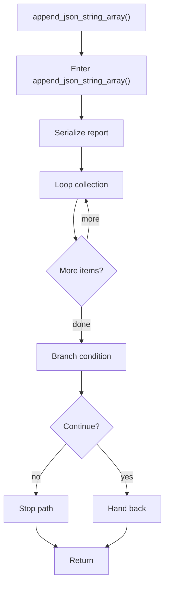

# append_json_string_array.cpp

- Source document: [algorithm_pipeline.cpp.md](../../algorithm_pipeline.cpp.md)
- Purpose: decoupled implementation logic for a future code unit.

### append_json_string_array()
This helper reshapes small pieces of data so the surrounding code can stay readable. It appears near line 243.

Inside the body, it mainly handles serialize report content, iterate over the active collection, and branch on runtime conditions.

The implementation iterates over a collection or repeated workload. It branches on runtime conditions instead of following one fixed path.

What it does:
- serialize report content
- iterate over the active collection
- branch on runtime conditions

Flow:

