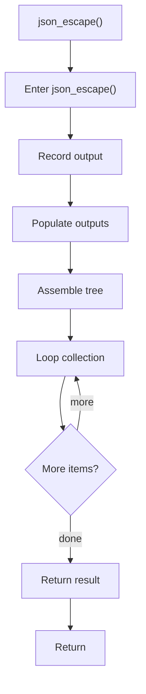

# json_escape.cpp

- Source document: [algorithm_pipeline.cpp.md](../../algorithm_pipeline.cpp.md)
- Purpose: decoupled implementation logic for a future code unit.

### json_escape()
This routine owns one focused piece of the file's behavior. It appears near line 224.

Inside the body, it mainly handles record derived output into collections, populate output fields or accumulators, assemble tree or artifact structures, and iterate over the active collection.

The implementation iterates over a collection or repeated workload. The caller receives a computed result or status from this step.

What it does:
- record derived output into collections
- populate output fields or accumulators
- assemble tree or artifact structures
- iterate over the active collection

Flow:

