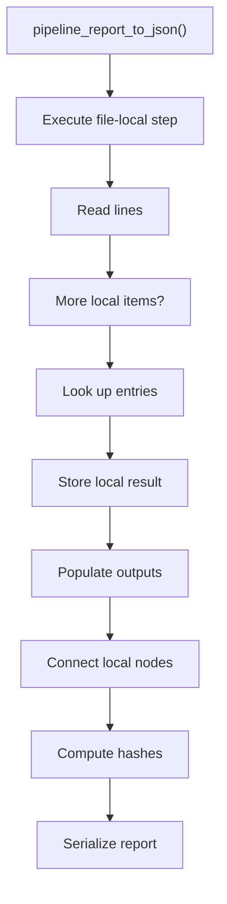
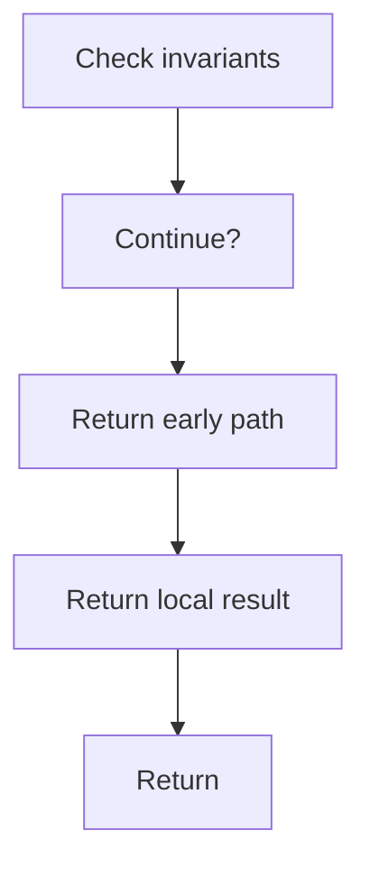

# pipeline_report_to_json.cpp

- Source document: [algorithm_pipeline.cpp.md](../../algorithm_pipeline.cpp.md)
- Purpose: decoupled implementation logic for a future code unit.

### pipeline_report_to_json()
This routine owns one focused piece of the file's behavior.

Inside the body, it mainly handles work one source line at a time, look up local indexes, store local findings, and fill local output fields.

The implementation iterates over a collection or repeated workload. It branches on runtime conditions instead of following one fixed path. The caller receives a computed result or status from this step.

What it does:
- work one source line at a time
- look up local indexes
- store local findings
- fill local output fields
- connect local structures
- compute hash metadata
- serialize report content
- validate pipeline invariants
- walk the local collection
- branch on local conditions

Flow:

### Block 8 - pipeline_report_to_json() Details
#### Slice 1 - Establish Local Entry
Quick summary: This slice shows the first file-local stage for pipeline_report_to_json.cpp and keeps the diagram scoped to this code unit.
Why this is separate: pipeline_report_to_json.cpp has multiple branches, loops, or stage changes, so this section is split out to keep one major intent visible at a time instead of forcing one oversized diagram.

#### Slice 2 - Handle Early Decisions
Quick summary: This slice shows the first local decision path for pipeline_report_to_json.cpp after setup.
Why this is separate: pipeline_report_to_json.cpp has multiple branches, loops, or stage changes, so this section is split out to keep one major intent visible at a time instead of forcing one oversized diagram.

