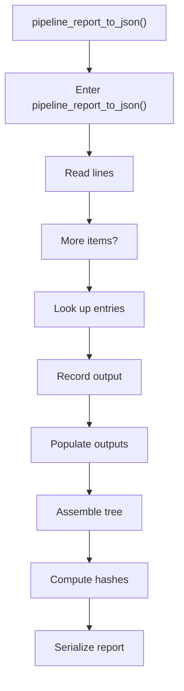
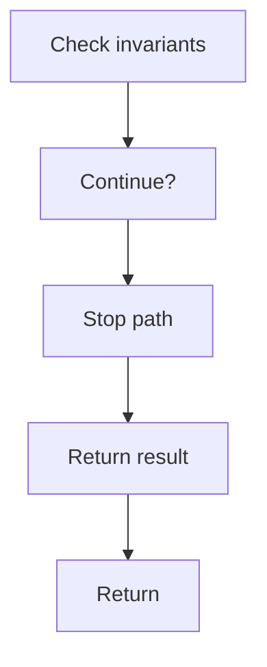

# pipeline_report_to_json.cpp

- Source document: [algorithm_pipeline.cpp.md](../../algorithm_pipeline.cpp.md)
- Purpose: decoupled implementation logic for a future code unit.

### pipeline_report_to_json()
This routine owns one focused piece of the file's behavior. It appears near line 606.

Inside the body, it mainly handles work one source line at a time, look up entries in previously collected maps or sets, record derived output into collections, and populate output fields or accumulators.

The implementation iterates over a collection or repeated workload. It branches on runtime conditions instead of following one fixed path. The caller receives a computed result or status from this step.

What it does:
- work one source line at a time
- look up entries in previously collected maps or sets
- record derived output into collections
- populate output fields or accumulators
- assemble tree or artifact structures
- compute hash metadata
- serialize report content
- validate pipeline invariants
- iterate over the active collection
- branch on runtime conditions

Flow:

### Block 8 - pipeline_report_to_json() Details
#### Slice 1 - Opening Intent
Quick summary: This slice shows the opening intent of pipeline_report_to_json.cpp and the first major actions that frame the rest of the flow.
Why this is separate: pipeline_report_to_json.cpp has multiple branches, loops, or stage changes, so this section is split out to keep one major intent visible at a time instead of forcing one oversized diagram.

#### Slice 2 - Early Branches
Quick summary: This slice covers the first branch-heavy continuation of pipeline_report_to_json.cpp after the opening path has been established.
Why this is separate: pipeline_report_to_json.cpp has multiple branches, loops, or stage changes, so this section is split out to keep one major intent visible at a time instead of forcing one oversized diagram.

