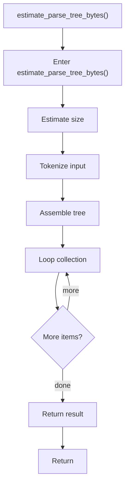

# estimate_parse_tree_bytes.cpp

- Source document: [algorithm_pipeline.cpp.md](../../algorithm_pipeline.cpp.md)
- Purpose: decoupled implementation logic for a future code unit.

### estimate_parse_tree_bytes()
This helper computes a size, count, or cost estimate used by surrounding logic. It appears near line 90.

Inside the body, it mainly handles estimate the size or cost of generated state, parse or tokenize input text, assemble tree or artifact structures, and iterate over the active collection.

The implementation iterates over a collection or repeated workload. The caller receives a computed result or status from this step.

What it does:
- estimate the size or cost of generated state
- parse or tokenize input text
- assemble tree or artifact structures
- iterate over the active collection

Flow:

