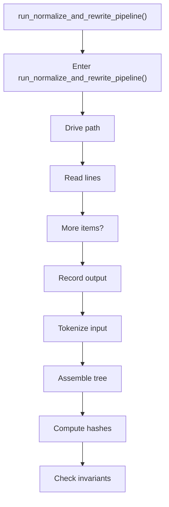
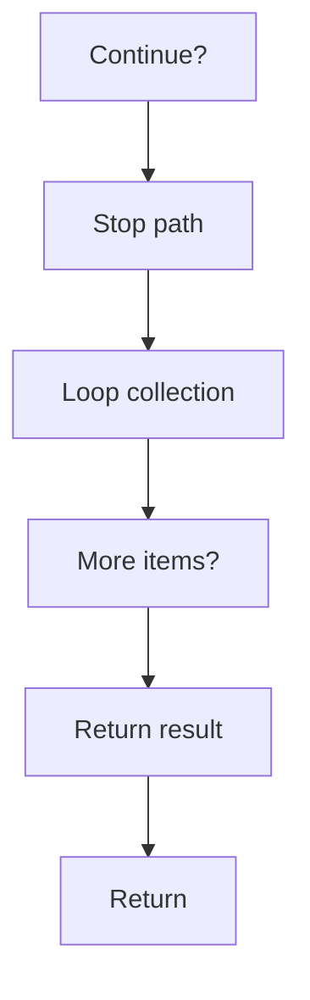

# run_normalize_and_rewrite_pipeline.cpp

- Source document: [algorithm_pipeline.cpp.md](../../algorithm_pipeline.cpp.md)
- Purpose: decoupled implementation logic for a future code unit.

### run_normalize_and_rewrite_pipeline()
This routine prepares or drives one of the main execution paths in the file. It appears near line 443.

Inside the body, it mainly handles drive the main execution path, work one source line at a time, record derived output into collections, and parse or tokenize input text.

The implementation iterates over a collection or repeated workload. It branches on runtime conditions instead of following one fixed path. The caller receives a computed result or status from this step.

What it does:
- drive the main execution path
- work one source line at a time
- record derived output into collections
- parse or tokenize input text
- assemble tree or artifact structures
- compute hash metadata
- validate pipeline invariants
- iterate over the active collection
- branch on runtime conditions

Flow:

### Block 7 - run_normalize_and_rewrite_pipeline() Details
#### Slice 1 - Opening Intent
Quick summary: This slice shows the opening intent of run_normalize_and_rewrite_pipeline.cpp and the first major actions that frame the rest of the flow.
Why this is separate: run_normalize_and_rewrite_pipeline.cpp has multiple branches, loops, or stage changes, so this section is split out to keep one major intent visible at a time instead of forcing one oversized diagram.

#### Slice 2 - Early Branches
Quick summary: This slice covers the first branch-heavy continuation of run_normalize_and_rewrite_pipeline.cpp after the opening path has been established.
Why this is separate: run_normalize_and_rewrite_pipeline.cpp has multiple branches, loops, or stage changes, so this section is split out to keep one major intent visible at a time instead of forcing one oversized diagram.

