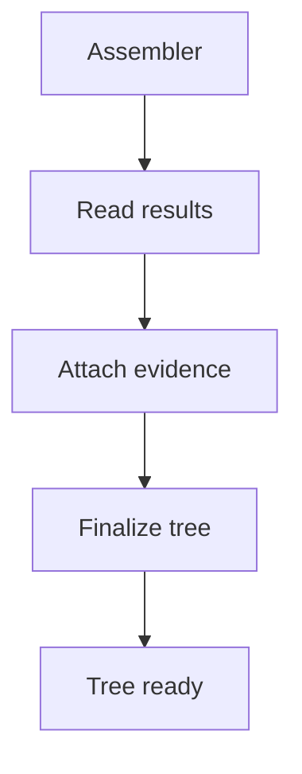

# Assembler

## Purpose
Assembler owns tree shape and output assembly.

## Files As Implementation Units
- `pattern_tree_assembler.md` represents the output tree builder.
- It receives hook evidence and creates the final tree.
- Hooks never create the final root or shared output shape.

## Folder Flow

