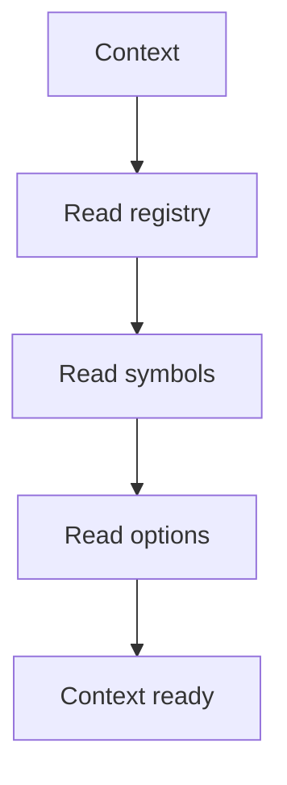

# Context

## Purpose
Context carries shared data from the middleman to hooks.

## Files As Implementation Units
- `pattern_context.md` represents the immutable request context.
- It carries registry data, symbols, options, and family selection.
- Hooks read this context instead of rebuilding shared state.

## Folder Flow

