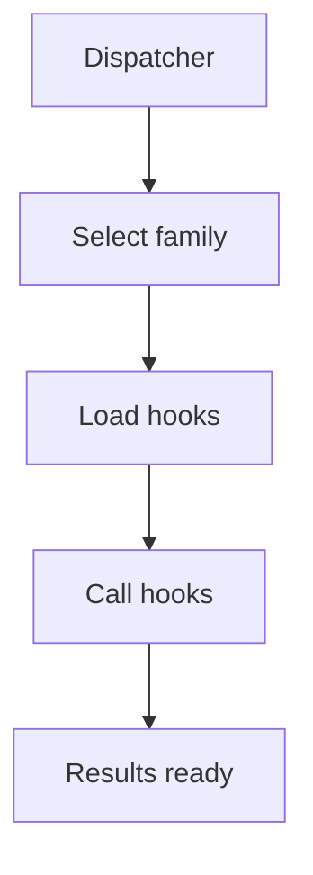

# Dispatcher

## Purpose
Dispatcher selects hook groups and calls hooks through the shared contract.

## Files As Implementation Units
- `pattern_hook_dispatcher.md` represents hook routing.
- It decides which pattern hooks run.
- It keeps Behavioural and Creational selection inside one shared pipeline.

## Folder Flow

