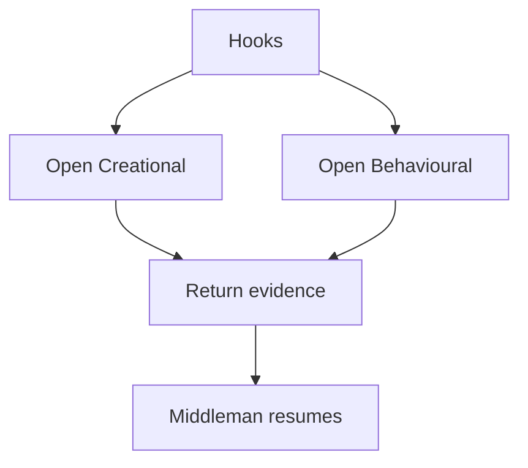

# Hooks

## Purpose
Hooks contain the pattern-specific algorithms. They are the only parts that differ by pattern family.

## Files As Implementation Units
- `Creational/*_hook.md` files represent Creational algorithms.
- `Behavioural/*_hook.md` files represent Behavioural algorithms.
- Hook files do not own class registration, context creation, dispatch, or tree assembly.

## Folder Flow

