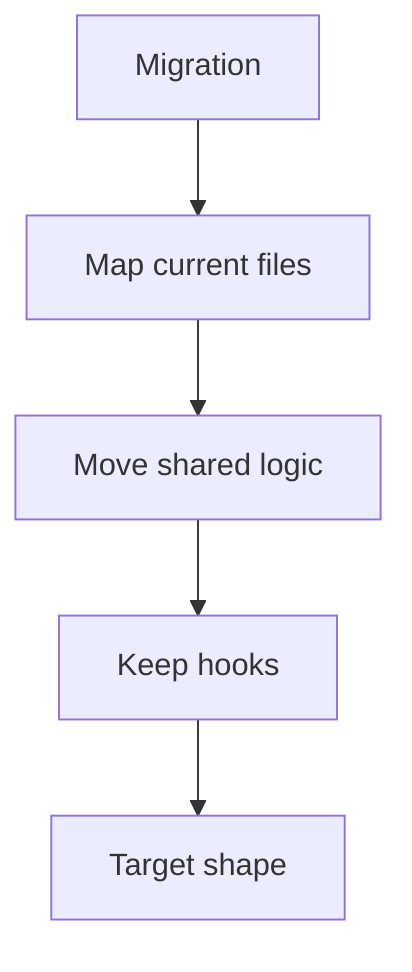

# Migration

## Purpose
Migration docs describe how current design-pattern logic should move toward this implementation-shaped structure.

## Files As Planning Units
- `current_to_middleman.cpp.md` maps scattered current logic to this target file tree.
- It is the checklist for future code work, not a runtime module.

## Folder Flow

