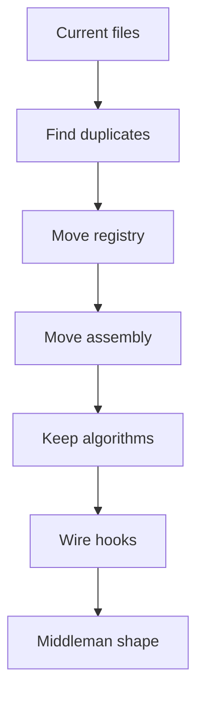
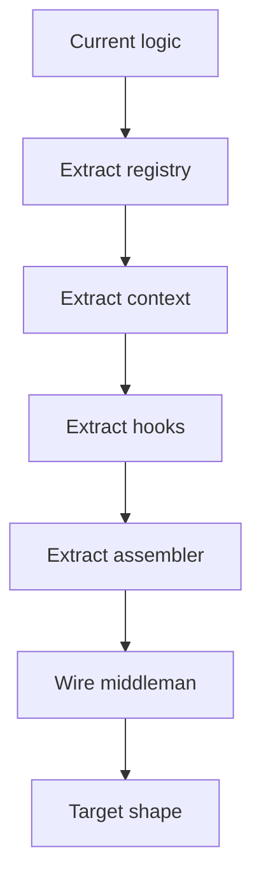

# current_to_middleman.cpp

## Role
Maps the current docs/code layout to the intended middleman-shaped implementation.

## Intended Source Role
This file is not a runtime module. It is the migration checklist for converting current scattered pattern logic into the implementation-shaped docs in this folder.

## Migration Flow

## Migration Rules
- Keep one middleman.
- Move class registration to Registry.
- Move function registration to Registry.
- Move shared state to Context.
- Move hook calls to Dispatcher.
- Move tree output to Assembler.
- Keep Factory logic in factory hook.
- Keep Singleton logic in singleton hook.
- Keep Builder logic in builder hook.
- Keep Strategy logic in strategy hook.
- Keep Observer logic in observer hook.

## Refactor Order

## Acceptance Checks
- Behavioural and Creational call one middleman.
- Each pattern hook uses the same context type.
- Class registration runs once per request.
- Function registration runs once per request.
- Tree root creation happens only in assembler.
- No pattern file owns shared assembly steps.
