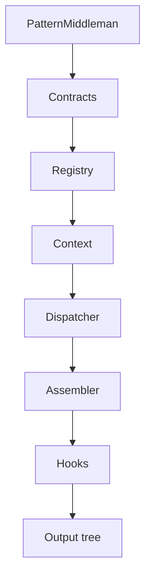
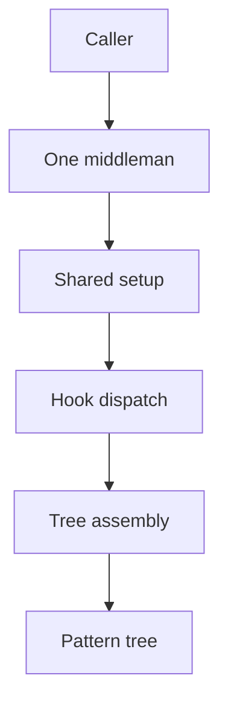

# PatternMiddlemanArchitecture

- Folder: docs/Codebase/Microservice/Modules/Source/PatternMiddlemanArchitecture
- Purpose: documentation mirror of the intended implementation structure
- Status: docs-only design target

## Intent
Treat this folder like the future source folder. File and folder names describe the intended implementation modules. The same structure can be mirrored later in actual code.

The architecture has one middleman. Behavioural and Creational do not get separate middlemen. They share registry, context, dispatcher, and tree assembly. Only the hook algorithms differ.

## Implementation Shape
Each Markdown file represents one future implementation unit. Read it as if it were the matching source file:

- Folder `Contracts` defines callable interfaces.
- Folder `Registry` builds shared lookup data.
- Folder `Context` packages request state.
- Folder `Dispatcher` calls pattern hooks.
- Folder `Assembler` creates output trees.
- Folder `Middleman` coordinates the process.
- Folder `Hooks` stores pattern-specific algorithms.

This keeps shared logic overlapping instead of duplicated. Behavioural and Creational flows pass through the same registry, context, dispatcher, assembler, and middleman. The only split is the hook selected by the dispatcher.

## Intended File Tree

## Module Map
- [pattern_middleman_contract.cpp.md](./Contracts/pattern_middleman_contract.cpp.md): public contract for one middleman.
- [pattern_hook_contract.cpp.md](./Contracts/pattern_hook_contract.cpp.md): virtual hook/function-pointer contract.
- [pattern_registry.cpp.md](./Registry/pattern_registry.cpp.md): shared class and function registration.
- [pattern_context.cpp.md](./Context/pattern_context.cpp.md): shared context passed to all hooks.
- [pattern_hook_dispatcher.cpp.md](./Dispatcher/pattern_hook_dispatcher.cpp.md): family selection and hook calls.
- [pattern_tree_assembler.cpp.md](./Assembler/pattern_tree_assembler.cpp.md): root, subtree, evidence, and empty-result assembly.
- [pattern_middleman.cpp.md](./Middleman/pattern_middleman.cpp.md): end-to-end orchestration.
- [README.md](./Hooks/Creational/README.md): Factory, Singleton, Builder hook group.
- [README.md](./Hooks/Behavioural/README.md): Strategy, Observer, scaffold hook group.

## Boundary
- Middleman owns process.
- Registry owns registration.
- Context owns shared state.
- Dispatcher owns hook calls.
- Assembler owns tree shape.
- Hooks own algorithms.
- No duplicated Behavioural middleman.
- No duplicated Creational middleman.

## Shared Flow

## Read Order
1. Start with `Middleman/pattern_middleman.md`.
2. Open `Registry/pattern_registry.md`.
3. Open `Context/pattern_context.md`.
4. Open `Dispatcher/pattern_hook_dispatcher.md`.
5. Open `Assembler/pattern_tree_assembler.md`.
6. Open only the hook file for the pattern algorithm.
