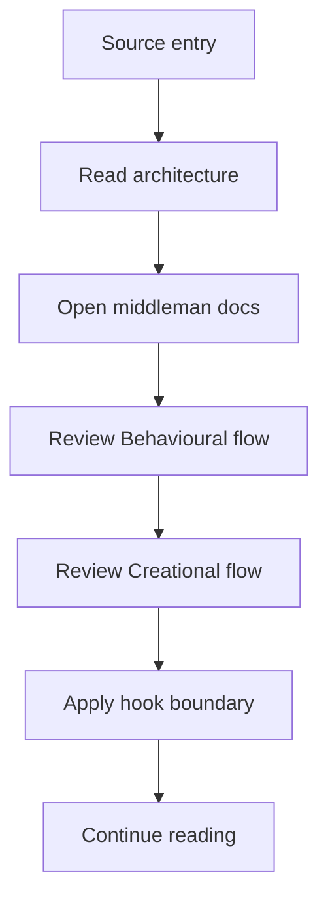
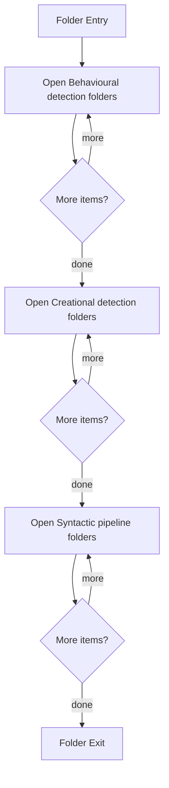

# Source

- Folder: docs/Codebase/Microservice/Modules/Source
- Descendant source docs: 55
- Generated on: 2026-04-23

## Logic Summary
C++ source implementations grouped by subsystem.

## Subsystem Story
This folder mainly acts as a navigation layer. Use it to understand how the deeper child folders divide the subsystem into smaller concerns.

## Architecture Notes
The Behavioural and Creational source areas should use a shared middleman for tree assembly and class registration. Read [README.md](./PatternMiddlemanArchitecture/README.md) before changing pattern detection docs or code.

## Folder Flow

## Child Folders By Logic
### Behavioural Detection
These child folders continue the subsystem by covering Behavioural pattern detection implementation..
- Behavioural/ : Behavioural pattern detection implementation.

### Creational Detection
These child folders continue the subsystem by covering Creational pattern detection over the generic parse tree..
- Creational/ : Creational pattern detection over the generic parse tree.

### Pattern Middleman Architecture
These documents define the required shared middleman flow for Behavioural and Creational tree assembly.
- PatternMiddlemanArchitecture/ : Shared architecture notes for class registration, tree assembly, and virtual pattern hooks.

### Syntactic Pipeline
These child folders continue the subsystem by covering Generic syntactic pipeline services such as CLI parsing, source reading, lexical hooks, documentation tagging, and reporting..
- SyntacticBrokenAST/ : Generic syntactic pipeline services such as CLI parsing, source reading, lexical hooks, documentation tagging, and reporting.

## Reading Hint
- Use the child folder groups to navigate deeper into this subsystem.

