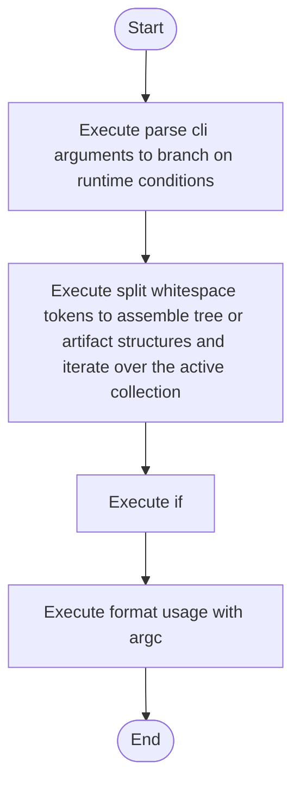

# cli_arguments.cpp

- Source: Microservice/Modules/Source/SyntacticBrokenAST/cli_arguments.cpp
- Kind: C++ implementation
- Lines: 93
- Role: Implements parsing, shadow-tree building, symbolization, hash linking, rendering, and reporting.
- Chronology: Runs at the start of the microservice flow to validate the requested source and target pattern pair.

## Notable Symbols
- split_whitespace_tokens
- input
- format_usage_with_argc
- parse_cli_arguments

## Direct Dependencies
- cli_arguments.hpp
- sstream
- string
- vector

## Implementation Story
This file implements the command-line contract for the executable. It supports the normal two-argument pattern pair, tolerates a compatibility form where both values arrive in one token, and rejects extra file-path arguments because the runtime now discovers inputs from the folder layout. This source file implements one of the generic middle-stage services in the C++ pipeline. It is executed after sources are loaded and before the final report and rendered outputs are written.   Implements parsing, shadow-tree building, symbolization, hash linking, rendering, and reporting.   Runs at the start of the microservice flow to validate the requested source and target pattern pair.  The implementation surface is easiest to recognize through symbols such as split_whitespace_tokens, input, format_usage_with_argc, and parse_cli_arguments.  In practice it collaborates directly with cli_arguments.hpp, sstream, string, and vector.

## Activity Diagram

## Documentation Note
- This markdown file is part of the generated docs/Codebase mirror.
- It was generated from the repository state on 2026-04-22 after reading the existing docs corpus and the current source tree.

