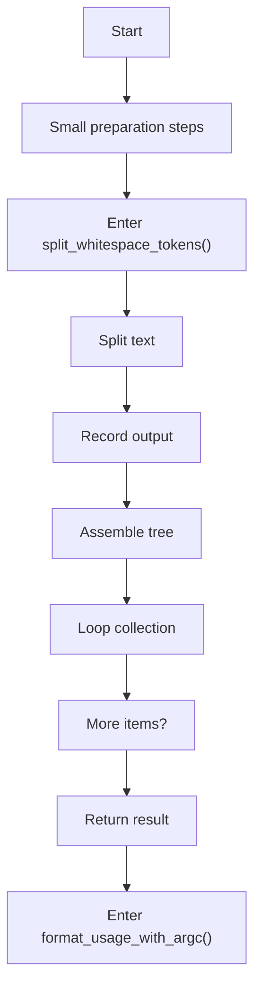
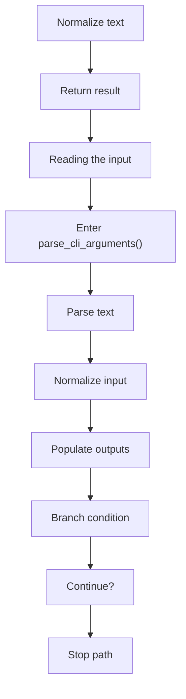
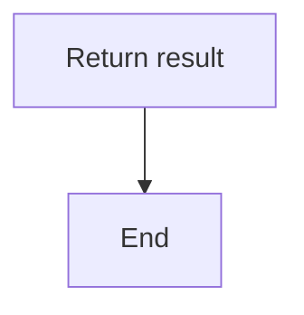
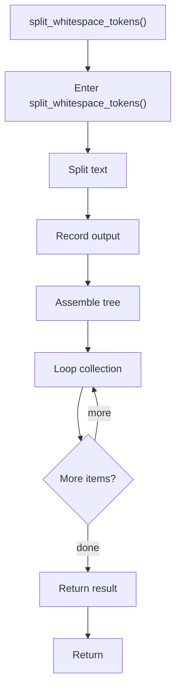
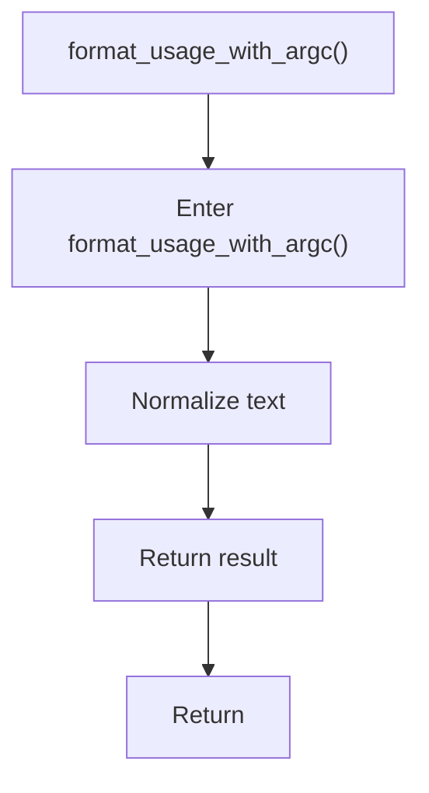
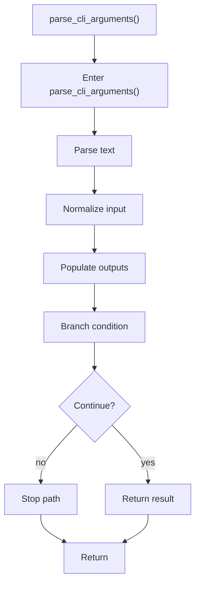

# cli_arguments.cpp

- Source: Microservice/Modules/Source/SyntacticBrokenAST/Input-and-CLI/cli_arguments.cpp
- Kind: C++ implementation
- Lines: 93

## Story
### What Happens Here

This file implements the command-line contract for the executable. It supports the normal two-argument pattern pair, tolerates a compatibility form where both values arrive in one token, and rejects extra file-path arguments because the runtime now discovers inputs from the folder layout. This source file implements one of the generic middle-stage services in the C++ pipeline. It is executed after sources are loaded and before the final report and rendered outputs are written.

### Why It Matters In The Flow

Runs at the start of the microservice flow to validate the requested source and target pattern pair.

### What To Watch While Reading

Normalizes the requested source and target pattern arguments before runtime execution begins. The main surface area is easiest to track through symbols such as split_whitespace_tokens, input, format_usage_with_argc, and parse_cli_arguments. It collaborates directly with Input-and-CLI/cli_arguments.hpp, sstream, string, and vector.

## Program Flow
This diagram follows the action path in plain words. Decision diamonds show where the file can stop, branch, or repeat work instead of simply passing through a straight line.

### Block 1 - Program Flow Details
#### Part 1

#### Part 2

#### Part 3

## Reading Map
Read this file as: Normalizes the requested source and target pattern arguments before runtime execution begins.

Where it sits in the run: Runs at the start of the microservice flow to validate the requested source and target pattern pair.

Names worth recognizing while reading: split_whitespace_tokens, input, format_usage_with_argc, and parse_cli_arguments.

It leans on nearby contracts or tools such as Input-and-CLI/cli_arguments.hpp, sstream, string, and vector.

## Story Groups

### Small Preparation Steps
These steps clean up names, text, or small values before the larger work begins.
- split_whitespace_tokens() (line 9): Split source text into smaller units, record derived output into collections, and assemble tree or artifact structures
- format_usage_with_argc() (line 20): Normalize or format text values

### Reading The Input
These steps turn raw text or arguments into something the program can follow.
- parse_cli_arguments() (line 28): Parse source text into structured values, normalize command or call input, and populate output fields or accumulators

## Function Stories

### split_whitespace_tokens()
This routine owns one focused piece of the file's behavior. It appears near line 9.

Inside the body, it mainly handles split source text into smaller units, record derived output into collections, assemble tree or artifact structures, and iterate over the active collection.

The implementation iterates over a collection or repeated workload. The caller receives a computed result or status from this step.

What it does:
- split source text into smaller units
- record derived output into collections
- assemble tree or artifact structures
- iterate over the active collection

Flow:

### format_usage_with_argc()
This helper reshapes small pieces of data so the surrounding code can stay readable. It appears near line 20.

Inside the body, it mainly handles normalize or format text values.

The caller receives a computed result or status from this step.

What it does:
- normalize or format text values

Flow:

### parse_cli_arguments()
This routine ingests source content and turns it into a more useful structured form. It appears near line 28.

Inside the body, it mainly handles parse source text into structured values, normalize command or call input, populate output fields or accumulators, and branch on runtime conditions.

It branches on runtime conditions instead of following one fixed path. The caller receives a computed result or status from this step.

What it does:
- parse source text into structured values
- normalize command or call input
- populate output fields or accumulators
- branch on runtime conditions

Flow:

## Documentation Note
- This markdown file is part of the generated docs/Codebase mirror.
- It was generated from the repository state on 2026-04-23 after reading the existing docs corpus and the current source tree.
