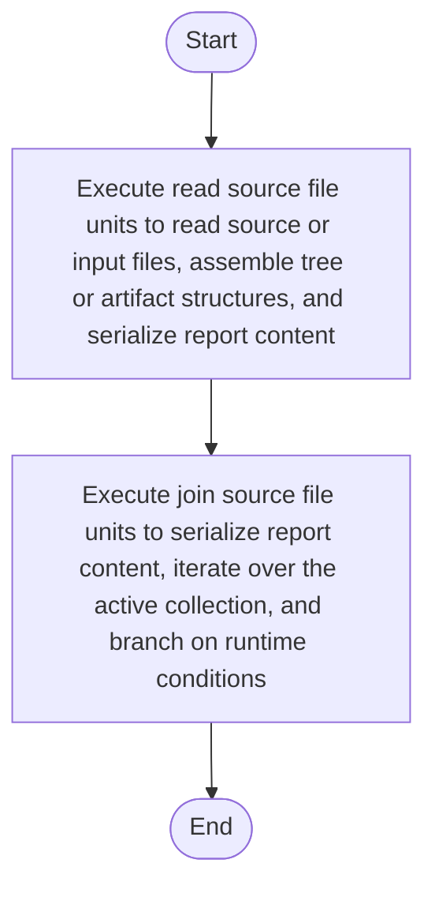

# source_reader.cpp

- Source: Microservice/Modules/Source/SyntacticBrokenAST/Input-and-CLI/source_reader.cpp
- Kind: C++ implementation
- Lines: 51
- Role: Implements parsing, shadow-tree building, symbolization, hash linking, rendering, and reporting.
- Chronology: Runs across the middle of the microservice flow to build parse trees, hash links, symbol tables, reports, and rendered outputs.

## Notable Symbols
- read_source_file_units
- file
- join_source_file_units

## Direct Dependencies
- Input-and-CLI/source_reader.hpp
- fstream
- iostream
- sstream

## File Outline
### Responsibility

This source file implements one of the generic middle-stage services in the C++ pipeline. It is executed after sources are loaded and before the final report and rendered outputs are written.

### Position In The Flow

Runs across the middle of the microservice flow to build parse trees, hash links, symbol tables, reports, and rendered outputs.

### Main Surface Area

Implements parsing, shadow-tree building, symbolization, hash linking, rendering, and reporting. The main surface area is easiest to track through symbols such as read_source_file_units, file, and join_source_file_units. It collaborates directly with Input-and-CLI/source_reader.hpp, fstream, iostream, and sstream.

## File Activity


## Function Walkthrough

### read_source_file_units
This routine ingests source content and turns it into a more useful structured form. It appears near line 6.

Inside the body, it mainly handles read source or input files, assemble tree or artifact structures, serialize report content, and iterate over the active collection.

The implementation iterates over a collection or repeated workload. It branches on runtime conditions instead of following one fixed path. The caller receives a computed result or status from this step.

Key operations:
- read source or input files
- assemble tree or artifact structures
- serialize report content
- iterate over the active collection
- branch on runtime conditions

Activity:
```mermaid
flowchart TD
    Start([read_source_file_units()])
    N0[Enter read_source_file_units()]
    N1[Read source or input files]
    N2[Assemble tree or artifact structures]
    N3[Serialize report content]
    N4[Iterate over the active collection]
    N5[Branch on runtime conditions]
    N6[Return the result to the caller]
    End([Return])
    Start --> N0
    N0 --> N1
    N1 --> N2
    N2 --> N3
    N3 --> N4
    N4 --> N5
    N5 --> N6
    N6 --> End
```

### join_source_file_units
This routine owns one focused piece of the file's behavior. It appears near line 36.

Inside the body, it mainly handles serialize report content, iterate over the active collection, and branch on runtime conditions.

The implementation iterates over a collection or repeated workload. It branches on runtime conditions instead of following one fixed path. The caller receives a computed result or status from this step.

Key operations:
- serialize report content
- iterate over the active collection
- branch on runtime conditions

Activity:
```mermaid
flowchart TD
    Start([join_source_file_units()])
    N0[Enter join_source_file_units()]
    N1[Serialize report content]
    N2[Iterate over the active collection]
    N3[Branch on runtime conditions]
    N4[Return the result to the caller]
    End([Return])
    Start --> N0
    N0 --> N1
    N1 --> N2
    N2 --> N3
    N3 --> N4
    N4 --> End
```

## Documentation Note
- This markdown file is part of the generated docs/Codebase mirror.
- It was generated from the repository state on 2026-04-23 after reading the existing docs corpus and the current source tree.

