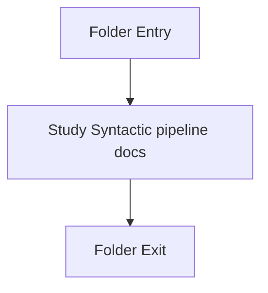

# Language-and-Structure

- Folder: docs/Codebase/Microservice/Modules/Source/SyntacticBrokenAST/Language-and-Structure
- Descendant source docs: 2
- Generated on: 2026-04-23

## Logic Summary
Language token definitions and structural hook logic that guide pattern-aware parsing.

## Subsystem Story
This folder is mostly leaf-level. The local documents here carry the main explanation of the subsystem without requiring much extra descent.

## Folder Flow

## Documents By Logic
### Syntactic Pipeline
These documents explain the local implementation by covering Implements parsing, shadow-tree building, symbolization, hash linking, rendering, and reporting. and Resolves pattern-specific structural keywords and records the crucial classes used by later filtering stages..
- language_tokens.cpp.md : Implements parsing, shadow-tree building, symbolization, hash linking, rendering, and reporting.
- lexical_structure_hooks.cpp.md : Resolves pattern-specific structural keywords and records the crucial classes used by later filtering stages.

## Reading Hint
- This folder is mostly leaf-level. Read the local file docs to understand the logic in this area.

