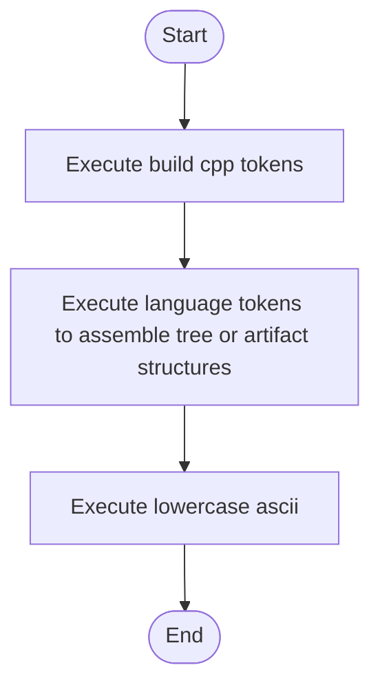

# language_tokens.cpp

- Source: Microservice/Modules/Source/SyntacticBrokenAST/Language-and-Structure/language_tokens.cpp
- Kind: C++ implementation
- Lines: 70
- Role: Implements parsing, shadow-tree building, symbolization, hash linking, rendering, and reporting.
- Chronology: Runs across the middle of the microservice flow to build parse trees, hash links, symbol tables, reports, and rendered outputs.

## Notable Symbols
- build_cpp_tokens
- language_tokens
- std::runtime_error
- lowercase_ascii

## Direct Dependencies
- Language-and-Structure/language_tokens.hpp
- algorithm
- cctype
- stdexcept

## File Outline
### Responsibility

This source file implements one of the generic middle-stage services in the C++ pipeline. It is executed after sources are loaded and before the final report and rendered outputs are written.

### Position In The Flow

Runs across the middle of the microservice flow to build parse trees, hash links, symbol tables, reports, and rendered outputs.

### Main Surface Area

Implements parsing, shadow-tree building, symbolization, hash linking, rendering, and reporting. The main surface area is easiest to track through symbols such as build_cpp_tokens, language_tokens, std::runtime_error, and lowercase_ascii. It collaborates directly with Language-and-Structure/language_tokens.hpp, algorithm, cctype, and stdexcept.

## File Activity


## Function Walkthrough

### build_cpp_tokens
This routine assembles a larger structure from the inputs it receives. It appears near line 9.

The caller receives a computed result or status from this step.

Key operations:
- This routine is primarily structural and does not expose obvious runtime operations from static inspection.

Activity:
```mermaid
flowchart TD
    Start([build_cpp_tokens()])
    N0[Enter build_cpp_tokens()]
    N1[Apply the routine's local logic]
    N2[Return the result to the caller]
    End([Return])
    Start --> N0
    N0 --> N1
    N1 --> N2
    N2 --> End
```

### language_tokens
This routine owns one focused piece of the file's behavior. It appears near line 48.

Inside the body, it mainly handles assemble tree or artifact structures.

The caller receives a computed result or status from this step.

Key operations:
- assemble tree or artifact structures

Activity:
```mermaid
flowchart TD
    Start([language_tokens()])
    N0[Enter language_tokens()]
    N1[Assemble tree or artifact structures]
    N2[Return the result to the caller]
    End([Return])
    Start --> N0
    N0 --> N1
    N1 --> N2
    N2 --> End
```

### lowercase_ascii
This routine owns one focused piece of the file's behavior. It appears near line 61.

The caller receives a computed result or status from this step.

Key operations:
- This routine is primarily structural and does not expose obvious runtime operations from static inspection.

Activity:
```mermaid
flowchart TD
    Start([lowercase_ascii()])
    N0[Enter lowercase_ascii()]
    N1[Apply the routine's local logic]
    N2[Return the result to the caller]
    End([Return])
    Start --> N0
    N0 --> N1
    N1 --> N2
    N2 --> End
```

## Documentation Note
- This markdown file is part of the generated docs/Codebase mirror.
- It was generated from the repository state on 2026-04-23 after reading the existing docs corpus and the current source tree.

