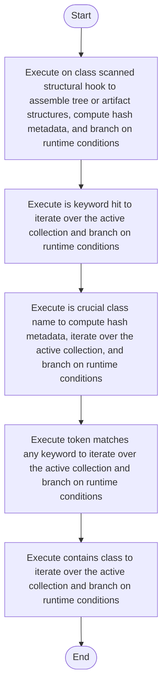

# lexical_structure_hooks.cpp

- Source: Microservice/Modules/Source/SyntacticBrokenAST/Language-and-Structure/lexical_structure_hooks.cpp
- Kind: C++ implementation
- Lines: 150
- Role: Implements parsing, shadow-tree building, symbolization, hash linking, rendering, and reporting.
- Chronology: Runs across the middle of the microservice flow to build parse trees, hash links, symbol tables, reports, and rendered outputs.

## Notable Symbols
- contains_class
- token_matches_any_keyword
- is_keyword_hit
- select_structural_keywords
- on_class_scanned_structural_hook
- reset_structural_analysis_state
- is_crucial_class_name
- get_crucial_class_registry

## Direct Dependencies
- Language-and-Structure/lexical_structure_hooks.hpp
- Logic/behavioural_structural_hooks.hpp
- Logic/creational_structural_hooks.hpp
- Language-and-Structure/language_tokens.hpp
- functional
- string
- utility
- vector

## File Outline
### Responsibility

This source file implements one of the generic middle-stage services in the C++ pipeline. It is executed after sources are loaded and before the final report and rendered outputs are written.

### Position In The Flow

Runs across the middle of the microservice flow to build parse trees, hash links, symbol tables, reports, and rendered outputs.

### Main Surface Area

Implements parsing, shadow-tree building, symbolization, hash linking, rendering, and reporting. The main surface area is easiest to track through symbols such as contains_class, token_matches_any_keyword, is_keyword_hit, and select_structural_keywords. It collaborates directly with Language-and-Structure/lexical_structure_hooks.hpp, Logic/behavioural_structural_hooks.hpp, Logic/creational_structural_hooks.hpp, and Language-and-Structure/language_tokens.hpp.

## File Activity


## Function Walkthrough

### contains_class
This routine owns one focused piece of the file's behavior. It appears near line 14.

Inside the body, it mainly handles iterate over the active collection and branch on runtime conditions.

The implementation iterates over a collection or repeated workload. It branches on runtime conditions instead of following one fixed path. The caller receives a computed result or status from this step.

Key operations:
- iterate over the active collection
- branch on runtime conditions

Activity:
```mermaid
flowchart TD
    Start([contains_class()])
    N0[Enter contains_class()]
    N1[Iterate over the active collection]
    N2[Branch on runtime conditions]
    N3[Return the result to the caller]
    End([Return])
    Start --> N0
    N0 --> N1
    N1 --> N2
    N2 --> N3
    N3 --> End
```

### token_matches_any_keyword
This routine owns one focused piece of the file's behavior. It appears near line 25.

Inside the body, it mainly handles iterate over the active collection and branch on runtime conditions.

The implementation iterates over a collection or repeated workload. It branches on runtime conditions instead of following one fixed path. The caller receives a computed result or status from this step.

Key operations:
- iterate over the active collection
- branch on runtime conditions

Activity:
```mermaid
flowchart TD
    Start([token_matches_any_keyword()])
    N0[Enter token_matches_any_keyword()]
    N1[Iterate over the active collection]
    N2[Branch on runtime conditions]
    N3[Return the result to the caller]
    End([Return])
    Start --> N0
    N0 --> N1
    N1 --> N2
    N2 --> N3
    N3 --> End
```

### is_keyword_hit
This routine owns one focused piece of the file's behavior. It appears near line 38.

Inside the body, it mainly handles iterate over the active collection and branch on runtime conditions.

The implementation iterates over a collection or repeated workload. It branches on runtime conditions instead of following one fixed path. The caller receives a computed result or status from this step.

Key operations:
- iterate over the active collection
- branch on runtime conditions

Activity:
```mermaid
flowchart TD
    Start([is_keyword_hit()])
    N0[Enter is_keyword_hit()]
    N1[Iterate over the active collection]
    N2[Branch on runtime conditions]
    N3[Return the result to the caller]
    End([Return])
    Start --> N0
    N0 --> N1
    N1 --> N2
    N2 --> N3
    N3 --> End
```

### select_structural_keywords
This routine owns one focused piece of the file's behavior. It appears near line 64.

Inside the body, it mainly handles branch on runtime conditions.

It branches on runtime conditions instead of following one fixed path. The caller receives a computed result or status from this step.

Key operations:
- branch on runtime conditions

Activity:
```mermaid
flowchart TD
    Start([select_structural_keywords()])
    N0[Enter select_structural_keywords()]
    N1[Branch on runtime conditions]
    N2[Return the result to the caller]
    End([Return])
    Start --> N0
    N0 --> N1
    N1 --> N2
    N2 --> End
```

### on_class_scanned_structural_hook
This routine owns one focused piece of the file's behavior. It appears near line 86.

Inside the body, it mainly handles assemble tree or artifact structures, compute hash metadata, and branch on runtime conditions.

It branches on runtime conditions instead of following one fixed path. The caller receives a computed result or status from this step.

Key operations:
- assemble tree or artifact structures
- compute hash metadata
- branch on runtime conditions

Activity:
```mermaid
flowchart TD
    Start([on_class_scanned_structural_hook()])
    N0[Enter on_class_scanned_structural_hook()]
    N1[Assemble tree or artifact structures]
    N2[Compute hash metadata]
    N3[Branch on runtime conditions]
    N4[Return the result to the caller]
    End([Return])
    Start --> N0
    N0 --> N1
    N1 --> N2
    N2 --> N3
    N3 --> N4
    N4 --> End
```

### reset_structural_analysis_state
This routine owns one focused piece of the file's behavior. It appears near line 118.

Key operations:
- This routine is primarily structural and does not expose obvious runtime operations from static inspection.

Activity:
```mermaid
flowchart TD
    Start([reset_structural_analysis_state()])
    N0[Enter reset_structural_analysis_state()]
    N1[Apply the routine's local logic]
    N2[Hand control back to the caller]
    End([Return])
    Start --> N0
    N0 --> N1
    N1 --> N2
    N2 --> End
```

### is_crucial_class_name
This routine owns one focused piece of the file's behavior. It appears near line 123.

Inside the body, it mainly handles compute hash metadata, iterate over the active collection, and branch on runtime conditions.

The implementation iterates over a collection or repeated workload. It branches on runtime conditions instead of following one fixed path. The caller receives a computed result or status from this step.

Key operations:
- compute hash metadata
- iterate over the active collection
- branch on runtime conditions

Activity:
```mermaid
flowchart TD
    Start([is_crucial_class_name()])
    N0[Enter is_crucial_class_name()]
    N1[Compute hash metadata]
    N2[Iterate over the active collection]
    N3[Branch on runtime conditions]
    N4[Return the result to the caller]
    End([Return])
    Start --> N0
    N0 --> N1
    N1 --> N2
    N2 --> N3
    N3 --> N4
    N4 --> End
```

### get_crucial_class_registry
This routine owns one focused piece of the file's behavior. It appears near line 145.

The caller receives a computed result or status from this step.

Key operations:
- This routine is primarily structural and does not expose obvious runtime operations from static inspection.

Activity:
```mermaid
flowchart TD
    Start([get_crucial_class_registry()])
    N0[Enter get_crucial_class_registry()]
    N1[Apply the routine's local logic]
    N2[Return the result to the caller]
    End([Return])
    Start --> N0
    N0 --> N1
    N1 --> N2
    N2 --> End
```

## Documentation Note
- This markdown file is part of the generated docs/Codebase mirror.
- It was generated from the repository state on 2026-04-23 after reading the existing docs corpus and the current source tree.

