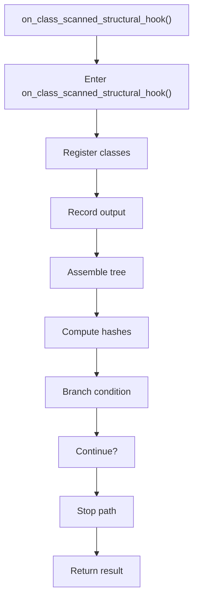

# on_class_scanned_structural_hook.cpp

- Source document: [lexical_structure_hooks.cpp.md](../../lexical_structure_hooks.cpp.md)
- Purpose: decoupled implementation logic for a future code unit.

### on_class_scanned_structural_hook()
This routine owns one focused piece of the file's behavior. It appears near line 86.

Inside the body, it mainly handles inspect or register class-level information, record derived output into collections, assemble tree or artifact structures, and compute hash metadata.

It branches on runtime conditions instead of following one fixed path. The caller receives a computed result or status from this step.

What it does:
- inspect or register class-level information
- record derived output into collections
- assemble tree or artifact structures
- compute hash metadata
- branch on runtime conditions

Flow:

### Block 2 - on_class_scanned_structural_hook() Details
#### Part 1

#### Part 2

