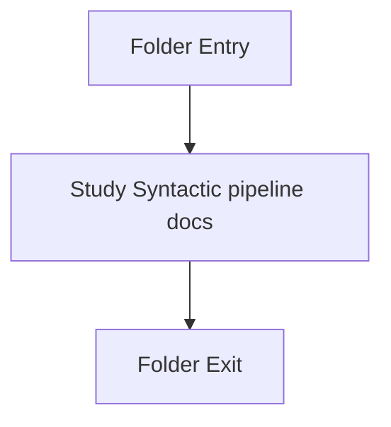

# Output-and-Rendering

- Folder: docs/Codebase/Microservice/Modules/Source/SyntacticBrokenAST/Output-and-Rendering
- Descendant source docs: 2
- Generated on: 2026-04-23

## Logic Summary
HTML/text rendering helpers and older generated-output helpers for syntactic outputs.

## Subsystem Story
This folder is mostly leaf-level. The local documents here carry the main explanation of the subsystem without requiring much extra descent.

## Folder Flow

## Documents By Logic
### Syntactic Pipeline
These documents explain the local implementation by covering Keeps the older generated-code writer isolated from the current tagging-focused runtime path. and Implements parsing, shadow-tree building, symbolization, hash linking, rendering, and reporting..
- codebase_output_writer.cpp.md : Keeps the older generated-code writer isolated from the current tagging-focused runtime path.
- tree_html_renderer.cpp.md : Implements parsing, shadow-tree building, symbolization, hash linking, rendering, and reporting.

## Reading Hint
- This folder is mostly leaf-level. Read the local file docs to understand the logic in this area.

