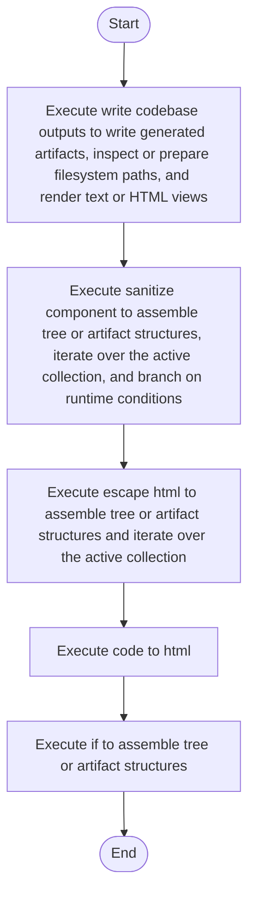

# codebase_output_writer.cpp

- Source: Microservice/Modules/Source/SyntacticBrokenAST/Output-and-Rendering/codebase_output_writer.cpp
- Kind: C++ implementation
- Lines: 118
- Role: Implements parsing, shadow-tree building, symbolization, hash linking, rendering, and reporting.
- Chronology: Runs across the middle of the microservice flow to build parse trees, hash links, symbol tables, reports, and rendered outputs.

## Notable Symbols
- escape_html
- code_to_html
- sanitize_component
- write_codebase_outputs
- base_cpp
- target_cpp
- base_html
- target_html

## Direct Dependencies
- Output-and-Rendering/codebase_output_writer.hpp
- filesystem
- fstream
- cctype
- string

## File Outline
### Responsibility

This source file implements one of the generic middle-stage services in the C++ pipeline. It is executed after sources are loaded and before the final report and rendered outputs are written.

### Position In The Flow

Runs across the middle of the microservice flow to build parse trees, hash links, symbol tables, reports, and rendered outputs.

### Main Surface Area

Implements parsing, shadow-tree building, symbolization, hash linking, rendering, and reporting. The main surface area is easiest to track through symbols such as escape_html, code_to_html, sanitize_component, and write_codebase_outputs. It collaborates directly with Output-and-Rendering/codebase_output_writer.hpp, filesystem, fstream, and cctype.

## File Activity


## Function Walkthrough

### escape_html
This helper reshapes small pieces of data so the surrounding code can stay readable. It appears near line 10.

Inside the body, it mainly handles assemble tree or artifact structures and iterate over the active collection.

The implementation iterates over a collection or repeated workload. The caller receives a computed result or status from this step.

Key operations:
- assemble tree or artifact structures
- iterate over the active collection

Activity:
```mermaid
flowchart TD
    Start([escape_html()])
    N0[Enter escape_html()]
    N1[Assemble tree or artifact structures]
    N2[Iterate over the active collection]
    N3[Return the result to the caller]
    End([Return])
    Start --> N0
    N0 --> N1
    N1 --> N2
    N2 --> N3
    N3 --> End
```

### code_to_html
This routine owns one focused piece of the file's behavior. It appears near line 30.

The caller receives a computed result or status from this step.

Key operations:
- This routine is primarily structural and does not expose obvious runtime operations from static inspection.

Activity:
```mermaid
flowchart TD
    Start([code_to_html()])
    N0[Enter code_to_html()]
    N1[Apply the routine's local logic]
    N2[Return the result to the caller]
    End([Return])
    Start --> N0
    N0 --> N1
    N1 --> N2
    N2 --> End
```

### sanitize_component
This routine owns one focused piece of the file's behavior. It appears near line 45.

Inside the body, it mainly handles assemble tree or artifact structures, iterate over the active collection, and branch on runtime conditions.

The implementation iterates over a collection or repeated workload. It branches on runtime conditions instead of following one fixed path. The caller receives a computed result or status from this step.

Key operations:
- assemble tree or artifact structures
- iterate over the active collection
- branch on runtime conditions

Activity:
```mermaid
flowchart TD
    Start([sanitize_component()])
    N0[Enter sanitize_component()]
    N1[Assemble tree or artifact structures]
    N2[Iterate over the active collection]
    N3[Branch on runtime conditions]
    N4[Return the result to the caller]
    End([Return])
    Start --> N0
    N0 --> N1
    N1 --> N2
    N2 --> N3
    N3 --> N4
    N4 --> End
```

### if
This routine owns one focused piece of the file's behavior. It appears near line 58.

Inside the body, it mainly handles assemble tree or artifact structures.

Key operations:
- assemble tree or artifact structures

Activity:
```mermaid
flowchart TD
    Start([if()])
    N0[Enter if()]
    N1[Assemble tree or artifact structures]
    N2[Hand control back to the caller]
    End([Return])
    Start --> N0
    N0 --> N1
    N1 --> N2
    N2 --> End
```

### write_codebase_outputs
This routine materializes internal state into an output format that later stages can consume. It appears near line 72.

Inside the body, it mainly handles write generated artifacts, inspect or prepare filesystem paths, render text or HTML views, and branch on runtime conditions.

It branches on runtime conditions instead of following one fixed path. The caller receives a computed result or status from this step.

Key operations:
- write generated artifacts
- inspect or prepare filesystem paths
- render text or HTML views
- branch on runtime conditions

Activity:
```mermaid
flowchart TD
    Start([write_codebase_outputs()])
    N0[Enter write_codebase_outputs()]
    N1[Write generated artifacts]
    N2[Inspect or prepare filesystem paths]
    N3[Render text or HTML views]
    N4[Branch on runtime conditions]
    N5[Return the result to the caller]
    End([Return])
    Start --> N0
    N0 --> N1
    N1 --> N2
    N2 --> N3
    N3 --> N4
    N4 --> N5
    N5 --> End
```

## Documentation Note
- This markdown file is part of the generated docs/Codebase mirror.
- It was generated from the repository state on 2026-04-23 after reading the existing docs corpus and the current source tree.

