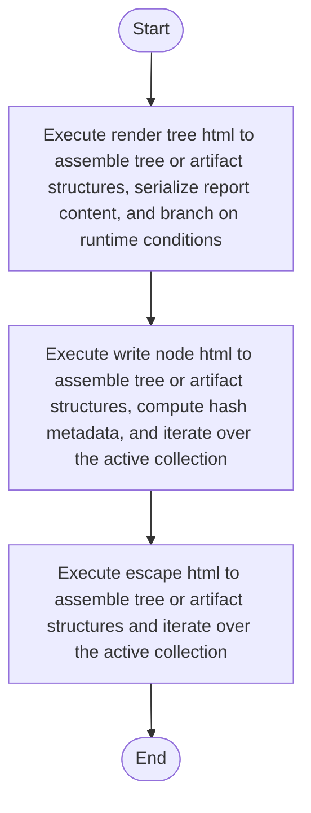

# tree_html_renderer.cpp

- Source: Microservice/Modules/Source/SyntacticBrokenAST/Output-and-Rendering/tree_html_renderer.cpp
- Kind: C++ implementation
- Lines: 95
- Role: Implements parsing, shadow-tree building, symbolization, hash linking, rendering, and reporting.
- Chronology: Runs across the middle of the microservice flow to build parse trees, hash links, symbol tables, reports, and rendered outputs.

## Notable Symbols
- escape_html
- write_node_html
- render_tree_html

## Direct Dependencies
- Output-and-Rendering/tree_html_renderer.hpp
- sstream

## File Outline
### Responsibility

This source file implements one of the generic middle-stage services in the C++ pipeline. It is executed after sources are loaded and before the final report and rendered outputs are written.

### Position In The Flow

Runs across the middle of the microservice flow to build parse trees, hash links, symbol tables, reports, and rendered outputs.

### Main Surface Area

Implements parsing, shadow-tree building, symbolization, hash linking, rendering, and reporting. The main surface area is easiest to track through symbols such as escape_html, write_node_html, and render_tree_html. It collaborates directly with Output-and-Rendering/tree_html_renderer.hpp and sstream.

## File Activity


## Function Walkthrough

### escape_html
This helper reshapes small pieces of data so the surrounding code can stay readable. It appears near line 7.

Inside the body, it mainly handles assemble tree or artifact structures and iterate over the active collection.

The implementation iterates over a collection or repeated workload. The caller receives a computed result or status from this step.

Key operations:
- assemble tree or artifact structures
- iterate over the active collection

Activity:
```mermaid
flowchart TD
    Start([escape_html()])
    N0[Enter escape_html()]
    N1[Assemble tree or artifact structures]
    N2[Iterate over the active collection]
    N3[Return the result to the caller]
    End([Return])
    Start --> N0
    N0 --> N1
    N1 --> N2
    N2 --> N3
    N3 --> End
```

### write_node_html
This routine materializes internal state into an output format that later stages can consume. It appears near line 27.

Inside the body, it mainly handles assemble tree or artifact structures, compute hash metadata, iterate over the active collection, and branch on runtime conditions.

The implementation iterates over a collection or repeated workload. It branches on runtime conditions instead of following one fixed path.

Key operations:
- assemble tree or artifact structures
- compute hash metadata
- iterate over the active collection
- branch on runtime conditions

Activity:
```mermaid
flowchart TD
    Start([write_node_html()])
    N0[Enter write_node_html()]
    N1[Assemble tree or artifact structures]
    N2[Compute hash metadata]
    N3[Iterate over the active collection]
    N4[Branch on runtime conditions]
    N5[Hand control back to the caller]
    End([Return])
    Start --> N0
    N0 --> N1
    N1 --> N2
    N2 --> N3
    N3 --> N4
    N4 --> N5
    N5 --> End
```

### render_tree_html
This routine materializes internal state into an output format that later stages can consume. It appears near line 51.

Inside the body, it mainly handles assemble tree or artifact structures, serialize report content, and branch on runtime conditions.

It branches on runtime conditions instead of following one fixed path. The caller receives a computed result or status from this step.

Key operations:
- assemble tree or artifact structures
- serialize report content
- branch on runtime conditions

Activity:
```mermaid
flowchart TD
    Start([render_tree_html()])
    N0[Enter render_tree_html()]
    N1[Assemble tree or artifact structures]
    N2[Serialize report content]
    N3[Branch on runtime conditions]
    N4[Return the result to the caller]
    End([Return])
    Start --> N0
    N0 --> N1
    N1 --> N2
    N2 --> N3
    N3 --> N4
    N4 --> End
```

## Documentation Note
- This markdown file is part of the generated docs/Codebase mirror.
- It was generated from the repository state on 2026-04-23 after reading the existing docs corpus and the current source tree.

