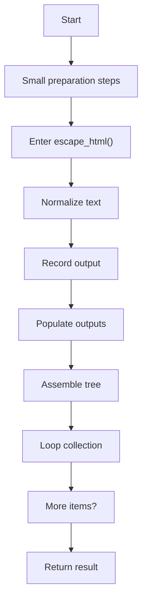
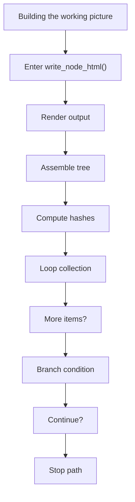
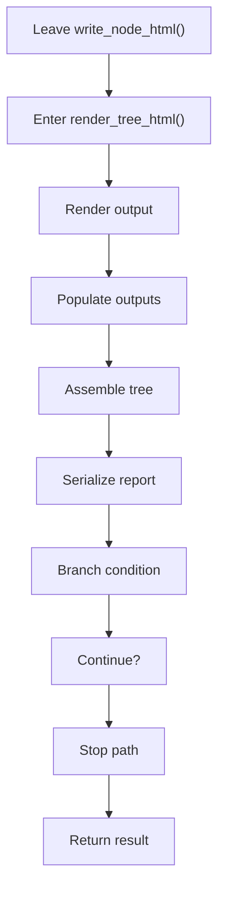
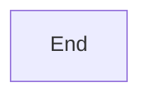
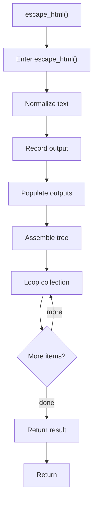
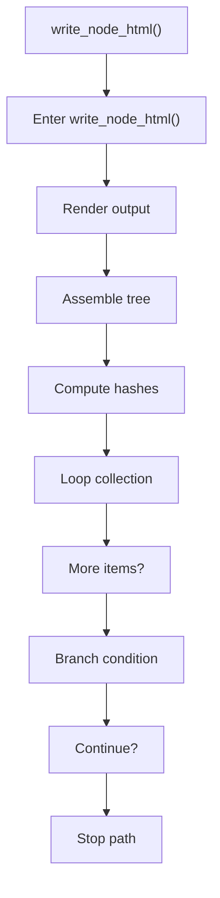
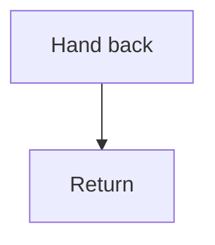
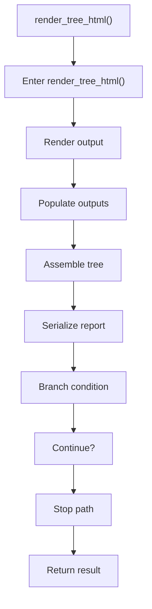
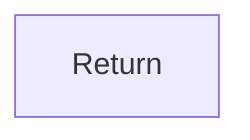

# tree_html_renderer.cpp

- Source: Microservice/Modules/Source/SyntacticBrokenAST/Output-and-Rendering/tree_html_renderer.cpp
- Kind: C++ implementation
- Lines: 95

## Story
### What Happens Here

This source file implements one of the generic middle-stage services in the C++ pipeline. It is executed after sources are loaded and before the final report and rendered outputs are written.

### Why It Matters In The Flow

Runs across the middle of the microservice flow to build parse trees, hash links, symbol tables, documentation tags, reports, and rendered outputs.

### What To Watch While Reading

Implements parsing, shadow-tree building, symbolization, hash linking, rendering, and reporting. The main surface area is easiest to track through symbols such as escape_html, write_node_html, and render_tree_html. It collaborates directly with Output-and-Rendering/tree_html_renderer.hpp and sstream.

## Program Flow
This diagram follows the action path in plain words. Decision diamonds show where the file can stop, branch, or repeat work instead of simply passing through a straight line.

### Block 1 - Program Flow Details
#### Part 1

#### Part 2

#### Part 3

#### Part 4

## Reading Map
Read this file as: Implements parsing, shadow-tree building, symbolization, hash linking, rendering, and reporting.

Where it sits in the run: Runs across the middle of the microservice flow to build parse trees, hash links, symbol tables, documentation tags, reports, and rendered outputs.

Names worth recognizing while reading: escape_html, write_node_html, and render_tree_html.

It leans on nearby contracts or tools such as Output-and-Rendering/tree_html_renderer.hpp and sstream.

## Story Groups

### Small Preparation Steps
These steps clean up names, text, or small values before the larger work begins.
- escape_html() (line 7): Normalize or format text values, record derived output into collections, and populate output fields or accumulators

### Building The Working Picture
These steps assemble the trees, models, or bundles used by the rest of the file.
- write_node_html() (line 27): Render or serialize the result, assemble tree or artifact structures, and compute hash metadata
- render_tree_html() (line 51): Render or serialize the result, populate output fields or accumulators, and assemble tree or artifact structures

## Function Stories

### escape_html()
This helper reshapes small pieces of data so the surrounding code can stay readable. It appears near line 7.

Inside the body, it mainly handles normalize or format text values, record derived output into collections, populate output fields or accumulators, and assemble tree or artifact structures.

The implementation iterates over a collection or repeated workload. The caller receives a computed result or status from this step.

What it does:
- normalize or format text values
- record derived output into collections
- populate output fields or accumulators
- assemble tree or artifact structures
- iterate over the active collection

Flow:

### write_node_html()
This routine materializes internal state into an output format that later stages can consume. It appears near line 27.

Inside the body, it mainly handles render or serialize the result, assemble tree or artifact structures, compute hash metadata, and iterate over the active collection.

The implementation iterates over a collection or repeated workload. It branches on runtime conditions instead of following one fixed path.

What it does:
- render or serialize the result
- assemble tree or artifact structures
- compute hash metadata
- iterate over the active collection
- branch on runtime conditions

Flow:

### Block 2 - write_node_html() Details
#### Part 1

#### Part 2

### render_tree_html()
This routine materializes internal state into an output format that later stages can consume. It appears near line 51.

Inside the body, it mainly handles render or serialize the result, populate output fields or accumulators, assemble tree or artifact structures, and serialize report content.

It branches on runtime conditions instead of following one fixed path. The caller receives a computed result or status from this step.

What it does:
- render or serialize the result
- populate output fields or accumulators
- assemble tree or artifact structures
- serialize report content
- branch on runtime conditions

Flow:

### Block 3 - render_tree_html() Details
#### Part 1

#### Part 2

## Documentation Note
- This markdown file is part of the generated docs/Codebase mirror.
- It was generated from the repository state on 2026-04-23 after reading the existing docs corpus and the current source tree.
