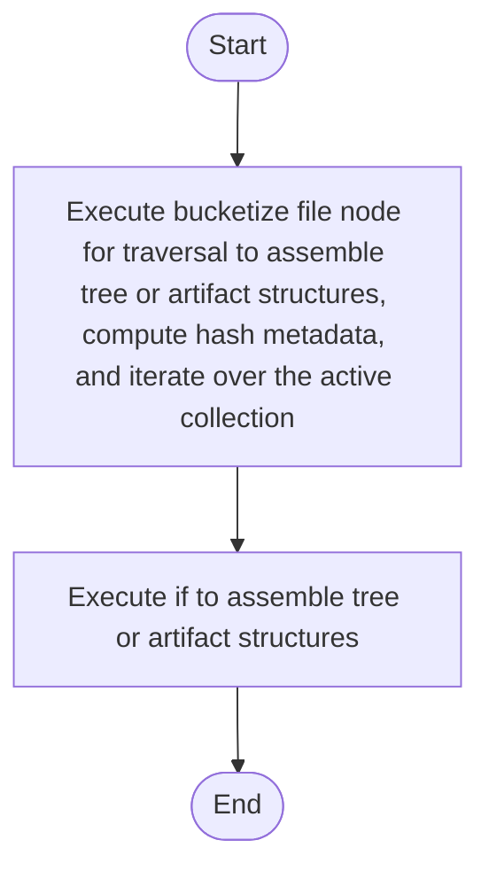

# bucket.cpp

- Source: Microservice/Modules/Source/SyntacticBrokenAST/ParseTree/Internal/bucket.cpp
- Kind: C++ implementation
- Lines: 68
- Role: Implements parsing, shadow-tree building, symbolization, hash linking, rendering, and reporting.
- Chronology: Runs across the middle of the microservice flow to build parse trees, hash links, symbol tables, reports, and rendered outputs.

## Notable Symbols
- bucketize_file_node_for_traversal

## Direct Dependencies
- Internal/parse_tree_internal.hpp
- utility
- vector

## File Outline
### Responsibility

This source file implements one internal part of the generic parse-tree engine. It contributes specialized behavior such as code generation, dependency handling, symbolization, or hash-link construction after the raw tree exists. This source file implements one of the generic middle-stage services in the C++ pipeline. It is executed after sources are loaded and before the final report and rendered outputs are written.

### Position In The Flow

Runs across the middle of the microservice flow to build parse trees, hash links, symbol tables, reports, and rendered outputs.

### Main Surface Area

Implements parsing, shadow-tree building, symbolization, hash linking, rendering, and reporting. The main surface area is easiest to track through symbols such as bucketize_file_node_for_traversal. It collaborates directly with Internal/parse_tree_internal.hpp, utility, and vector.

## File Activity


## Function Walkthrough

### bucketize_file_node_for_traversal
This routine owns one focused piece of the file's behavior. It appears near line 8.

Inside the body, it mainly handles assemble tree or artifact structures, compute hash metadata, iterate over the active collection, and branch on runtime conditions.

The implementation iterates over a collection or repeated workload. It branches on runtime conditions instead of following one fixed path.

Key operations:
- assemble tree or artifact structures
- compute hash metadata
- iterate over the active collection
- branch on runtime conditions

Activity:
```mermaid
flowchart TD
    Start([bucketize_file_node_for_traversal()])
    N0[Enter bucketize_file_node_for_traversal()]
    N1[Assemble tree or artifact structures]
    N2[Compute hash metadata]
    N3[Iterate over the active collection]
    N4[Branch on runtime conditions]
    N5[Hand control back to the caller]
    End([Return])
    Start --> N0
    N0 --> N1
    N1 --> N2
    N2 --> N3
    N3 --> N4
    N4 --> N5
    N5 --> End
```

### if
This routine owns one focused piece of the file's behavior. It appears near line 23.

Inside the body, it mainly handles assemble tree or artifact structures.

Key operations:
- assemble tree or artifact structures

Activity:
```mermaid
flowchart TD
    Start([if()])
    N0[Enter if()]
    N1[Assemble tree or artifact structures]
    N2[Hand control back to the caller]
    End([Return])
    Start --> N0
    N0 --> N1
    N1 --> N2
    N2 --> End
```

## Documentation Note
- This markdown file is part of the generated docs/Codebase mirror.
- It was generated from the repository state on 2026-04-23 after reading the existing docs corpus and the current source tree.

