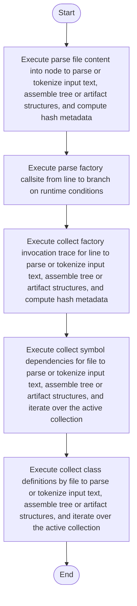

# build.cpp

- Source: Microservice/Modules/Source/SyntacticBrokenAST/ParseTree/Internal/build.cpp
- Kind: C++ implementation
- Lines: 470
- Role: Implements parsing, shadow-tree building, symbolization, hash linking, rendering, and reporting.
- Chronology: Runs across the middle of the microservice flow to build parse trees, hash links, symbol tables, reports, and rendered outputs.

## Notable Symbols
- clear_statement_buffers
- trim_ascii
- has_factory_keyword
- lowercase_ascii
- token_is_registered_class
- track_factory_instance_declaration
- declaration_regex
- parse_factory_callsite_from_line
- static_declaration_regex
- static_assignment_regex
- instance_dot_declaration_regex
- instance_dot_assignment_regex

## Direct Dependencies
- Internal/parse_tree_internal.hpp
- language_tokens.hpp
- lexical_structure_hooks.hpp
- cctype
- regex
- string
- unordered_map
- unordered_set
- utility
- vector

## Implementation Story
This file implements the line-by-line parse-tree construction mechanics. It tokenizes input lines, detects includes and classes, records line hash traces and factory invocation traces, opens and closes block scopes, and emits statements into the file-local parse tree. This source file implements one internal part of the generic parse-tree engine. It contributes specialized behavior such as code generation, dependency handling, symbolization, or hash-link construction after the raw tree exists. This source file implements one of the generic middle-stage services in the C++ pipeline. It is executed after sources are loaded and before the final report and rendered outputs are written.   Implements parsing, shadow-tree building, symbolization, hash linking, rendering, and reporting.   Runs across the middle of the microservice flow to build parse trees, hash links, symbol tables, reports, and rendered outputs.  The implementation surface is easiest to recognize through symbols such as clear_statement_buffers, trim_ascii, has_factory_keyword, and lowercase_ascii.  In practice it collaborates directly with Internal/parse_tree_internal.hpp, language_tokens.hpp, lexical_structure_hooks.hpp, and cctype.

## Activity Diagram

## Documentation Note
- This markdown file is part of the generated docs/Codebase mirror.
- It was generated from the repository state on 2026-04-22 after reading the existing docs corpus and the current source tree.

