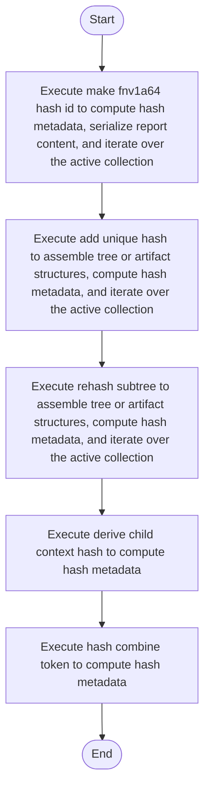

# hash.cpp

- Source: Microservice/Modules/Source/SyntacticBrokenAST/ParseTree/Internal/hash.cpp
- Kind: C++ implementation
- Lines: 114
- Role: Implements parsing, shadow-tree building, symbolization, hash linking, rendering, and reporting.
- Chronology: Runs across the middle of the microservice flow to build parse trees, hash links, symbol tables, reports, and rendered outputs.

## Notable Symbols
- hash_combine_token
- make_fnv1a64_hash_id
- std::setfill
- derive_child_context_hash
- hash_class_name_with_file
- rehash_subtree
- add_unique_hash
- usage_hash_suffix
- usage_hash_list

## Direct Dependencies
- Internal/parse_tree_internal.hpp
- cstdint
- functional
- iomanip
- sstream
- string
- vector

## File Outline
### Responsibility

This source file implements one internal part of the generic parse-tree engine. It contributes specialized behavior such as code generation, dependency handling, symbolization, or hash-link construction after the raw tree exists. This source file implements one of the generic middle-stage services in the C++ pipeline. It is executed after sources are loaded and before the final report and rendered outputs are written.

### Position In The Flow

Runs across the middle of the microservice flow to build parse trees, hash links, symbol tables, reports, and rendered outputs.

### Main Surface Area

Implements parsing, shadow-tree building, symbolization, hash linking, rendering, and reporting. The main surface area is easiest to track through symbols such as hash_combine_token, make_fnv1a64_hash_id, std::setfill, and derive_child_context_hash. It collaborates directly with Internal/parse_tree_internal.hpp, cstdint, functional, and iomanip.

## File Activity


## Function Walkthrough

### hash_combine_token
This routine owns one focused piece of the file's behavior. It appears near line 12.

Inside the body, it mainly handles compute hash metadata.

The caller receives a computed result or status from this step.

Key operations:
- compute hash metadata

Activity:
```mermaid
flowchart TD
    Start([hash_combine_token()])
    N0[Enter hash_combine_token()]
    N1[Compute hash metadata]
    N2[Return the result to the caller]
    End([Return])
    Start --> N0
    N0 --> N1
    N1 --> N2
    N2 --> End
```

### make_fnv1a64_hash_id
This routine assembles a larger structure from the inputs it receives. It appears near line 16.

Inside the body, it mainly handles compute hash metadata, serialize report content, and iterate over the active collection.

The implementation iterates over a collection or repeated workload. The caller receives a computed result or status from this step.

Key operations:
- compute hash metadata
- serialize report content
- iterate over the active collection

Activity:
```mermaid
flowchart TD
    Start([make_fnv1a64_hash_id()])
    N0[Enter make_fnv1a64_hash_id()]
    N1[Compute hash metadata]
    N2[Serialize report content]
    N3[Iterate over the active collection]
    N4[Return the result to the caller]
    End([Return])
    Start --> N0
    N0 --> N1
    N1 --> N2
    N2 --> N3
    N3 --> N4
    N4 --> End
```

### derive_child_context_hash
This routine owns one focused piece of the file's behavior. It appears near line 34.

Inside the body, it mainly handles compute hash metadata.

The caller receives a computed result or status from this step.

Key operations:
- compute hash metadata

Activity:
```mermaid
flowchart TD
    Start([derive_child_context_hash()])
    N0[Enter derive_child_context_hash()]
    N1[Compute hash metadata]
    N2[Return the result to the caller]
    End([Return])
    Start --> N0
    N0 --> N1
    N1 --> N2
    N2 --> End
```

### hash_class_name_with_file
This routine owns one focused piece of the file's behavior. It appears near line 47.

Inside the body, it mainly handles compute hash metadata.

The caller receives a computed result or status from this step.

Key operations:
- compute hash metadata

Activity:
```mermaid
flowchart TD
    Start([hash_class_name_with_file()])
    N0[Enter hash_class_name_with_file()]
    N1[Compute hash metadata]
    N2[Return the result to the caller]
    End([Return])
    Start --> N0
    N0 --> N1
    N1 --> N2
    N2 --> End
```

### rehash_subtree
This routine owns one focused piece of the file's behavior. It appears near line 52.

Inside the body, it mainly handles assemble tree or artifact structures, compute hash metadata, and iterate over the active collection.

The implementation iterates over a collection or repeated workload.

Key operations:
- assemble tree or artifact structures
- compute hash metadata
- iterate over the active collection

Activity:
```mermaid
flowchart TD
    Start([rehash_subtree()])
    N0[Enter rehash_subtree()]
    N1[Assemble tree or artifact structures]
    N2[Compute hash metadata]
    N3[Iterate over the active collection]
    N4[Hand control back to the caller]
    End([Return])
    Start --> N0
    N0 --> N1
    N1 --> N2
    N2 --> N3
    N3 --> N4
    N4 --> End
```

### add_unique_hash
This routine owns one focused piece of the file's behavior. It appears near line 61.

Inside the body, it mainly handles assemble tree or artifact structures, compute hash metadata, iterate over the active collection, and branch on runtime conditions.

The implementation iterates over a collection or repeated workload. It branches on runtime conditions instead of following one fixed path. The caller receives a computed result or status from this step.

Key operations:
- assemble tree or artifact structures
- compute hash metadata
- iterate over the active collection
- branch on runtime conditions

Activity:
```mermaid
flowchart TD
    Start([add_unique_hash()])
    N0[Enter add_unique_hash()]
    N1[Assemble tree or artifact structures]
    N2[Compute hash metadata]
    N3[Iterate over the active collection]
    N4[Branch on runtime conditions]
    N5[Return the result to the caller]
    End([Return])
    Start --> N0
    N0 --> N1
    N1 --> N2
    N2 --> N3
    N3 --> N4
    N4 --> N5
    N5 --> End
```

### usage_hash_suffix
This routine owns one focused piece of the file's behavior. It appears near line 73.

Inside the body, it mainly handles compute hash metadata, serialize report content, iterate over the active collection, and branch on runtime conditions.

The implementation iterates over a collection or repeated workload. It branches on runtime conditions instead of following one fixed path. The caller receives a computed result or status from this step.

Key operations:
- compute hash metadata
- serialize report content
- iterate over the active collection
- branch on runtime conditions

Activity:
```mermaid
flowchart TD
    Start([usage_hash_suffix()])
    N0[Enter usage_hash_suffix()]
    N1[Compute hash metadata]
    N2[Serialize report content]
    N3[Iterate over the active collection]
    N4[Branch on runtime conditions]
    N5[Return the result to the caller]
    End([Return])
    Start --> N0
    N0 --> N1
    N1 --> N2
    N2 --> N3
    N3 --> N4
    N4 --> N5
    N5 --> End
```

### usage_hash_list
This routine owns one focused piece of the file's behavior. It appears near line 94.

Inside the body, it mainly handles compute hash metadata, serialize report content, iterate over the active collection, and branch on runtime conditions.

The implementation iterates over a collection or repeated workload. It branches on runtime conditions instead of following one fixed path. The caller receives a computed result or status from this step.

Key operations:
- compute hash metadata
- serialize report content
- iterate over the active collection
- branch on runtime conditions

Activity:
```mermaid
flowchart TD
    Start([usage_hash_list()])
    N0[Enter usage_hash_list()]
    N1[Compute hash metadata]
    N2[Serialize report content]
    N3[Iterate over the active collection]
    N4[Branch on runtime conditions]
    N5[Return the result to the caller]
    End([Return])
    Start --> N0
    N0 --> N1
    N1 --> N2
    N2 --> N3
    N3 --> N4
    N4 --> N5
    N5 --> End
```

## Documentation Note
- This markdown file is part of the generated docs/Codebase mirror.
- It was generated from the repository state on 2026-04-23 after reading the existing docs corpus and the current source tree.

