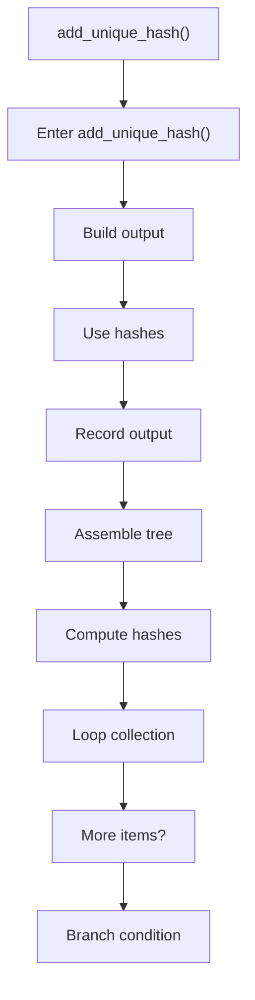
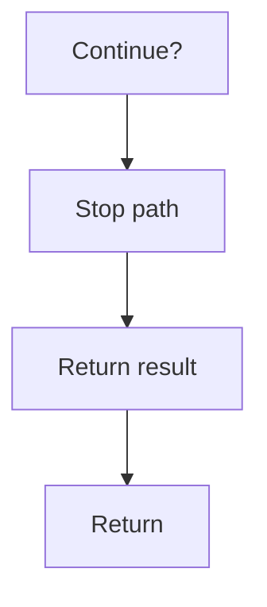

# add_unique_hash.cpp

- Source document: [hash.cpp.md](../../hash.cpp.md)
- Purpose: decoupled implementation logic for a future code unit.

### add_unique_hash()
This routine owns one focused piece of the file's behavior. It appears near line 61.

Inside the body, it mainly handles build or append the next output structure, compute or reuse hash-oriented identifiers, record derived output into collections, and assemble tree or artifact structures.

The implementation iterates over a collection or repeated workload. It branches on runtime conditions instead of following one fixed path. The caller receives a computed result or status from this step.

What it does:
- build or append the next output structure
- compute or reuse hash-oriented identifiers
- record derived output into collections
- assemble tree or artifact structures
- compute hash metadata
- iterate over the active collection
- branch on runtime conditions

Flow:

### Block 2 - add_unique_hash() Details
#### Part 1

#### Part 2

