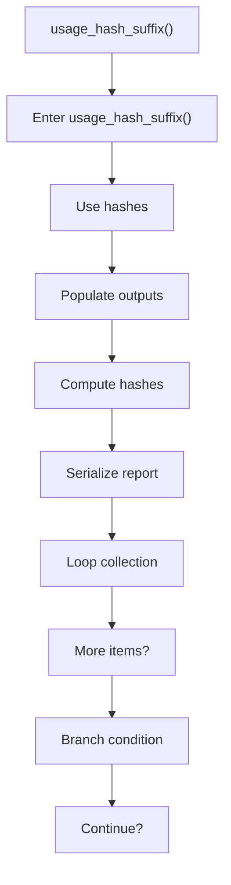
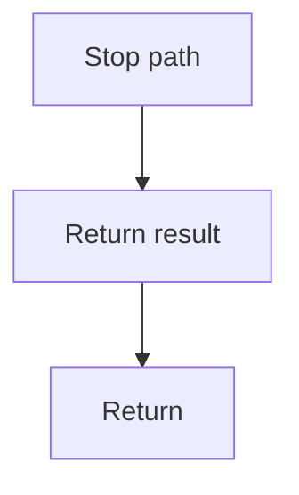

# usage_hash_suffix.cpp

- Source document: [hash.cpp.md](../../hash.cpp.md)
- Purpose: decoupled implementation logic for a future code unit.

### usage_hash_suffix()
This routine owns one focused piece of the file's behavior. It appears near line 73.

Inside the body, it mainly handles compute or reuse hash-oriented identifiers, populate output fields or accumulators, compute hash metadata, and serialize report content.

The implementation iterates over a collection or repeated workload. It branches on runtime conditions instead of following one fixed path. The caller receives a computed result or status from this step.

What it does:
- compute or reuse hash-oriented identifiers
- populate output fields or accumulators
- compute hash metadata
- serialize report content
- iterate over the active collection
- branch on runtime conditions

Flow:

### Block 3 - usage_hash_suffix() Details
#### Part 1

#### Part 2

