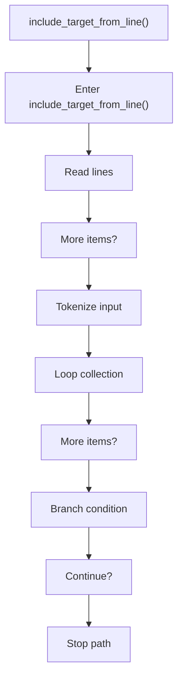
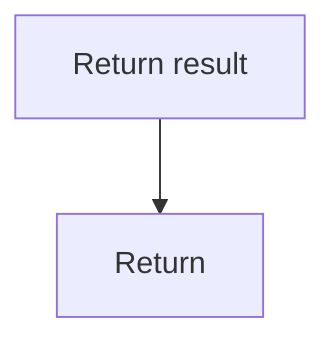

# include_target_from_line.cpp

- Source document: [line.cpp.md](../../line.cpp.md)
- Purpose: decoupled implementation logic for a future code unit.

### include_target_from_line()
This routine owns one focused piece of the file's behavior. It appears near line 120.

Inside the body, it mainly handles work one source line at a time, parse or tokenize input text, iterate over the active collection, and branch on runtime conditions.

The implementation iterates over a collection or repeated workload. It branches on runtime conditions instead of following one fixed path. The caller receives a computed result or status from this step.

What it does:
- work one source line at a time
- parse or tokenize input text
- iterate over the active collection
- branch on runtime conditions

Flow:

### Block 5 - include_target_from_line() Details
#### Part 1

#### Part 2

