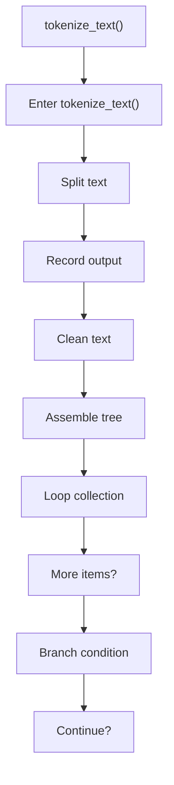
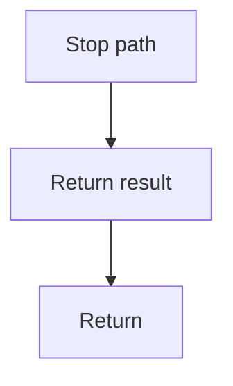

# tokenize_text.cpp

- Source document: [line.cpp.md](../../line.cpp.md)
- Purpose: decoupled implementation logic for a future code unit.

### tokenize_text()
This routine ingests source content and turns it into a more useful structured form. It appears near line 11.

Inside the body, it mainly handles split source text into smaller units, record derived output into collections, normalize raw text before later parsing, and assemble tree or artifact structures.

The implementation iterates over a collection or repeated workload. It branches on runtime conditions instead of following one fixed path. The caller receives a computed result or status from this step.

What it does:
- split source text into smaller units
- record derived output into collections
- normalize raw text before later parsing
- assemble tree or artifact structures
- iterate over the active collection
- branch on runtime conditions

Flow:

### Block 2 - tokenize_text() Details
#### Part 1

#### Part 2

