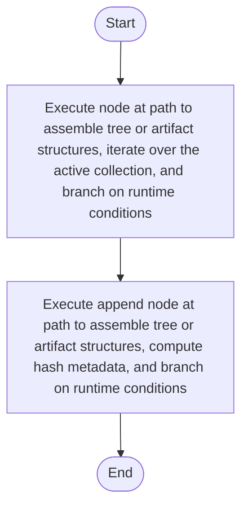

# node_path.cpp

- Source: Microservice/Modules/Source/SyntacticBrokenAST/ParseTree/Internal/node_path.cpp
- Kind: C++ implementation
- Lines: 50
- Role: Implements parsing, shadow-tree building, symbolization, hash linking, rendering, and reporting.
- Chronology: Runs across the middle of the microservice flow to build parse trees, hash links, symbol tables, reports, and rendered outputs.

## Notable Symbols
- node_at_path
- append_node_at_path

## Direct Dependencies
- Internal/parse_tree_internal.hpp
- utility
- vector

## File Outline
### Responsibility

This source file implements one internal part of the generic parse-tree engine. It contributes specialized behavior such as code generation, dependency handling, symbolization, or hash-link construction after the raw tree exists. This source file implements one of the generic middle-stage services in the C++ pipeline. It is executed after sources are loaded and before the final report and rendered outputs are written.

### Position In The Flow

Runs across the middle of the microservice flow to build parse trees, hash links, symbol tables, reports, and rendered outputs.

### Main Surface Area

Implements parsing, shadow-tree building, symbolization, hash linking, rendering, and reporting. The main surface area is easiest to track through symbols such as node_at_path and append_node_at_path. It collaborates directly with Internal/parse_tree_internal.hpp, utility, and vector.

## File Activity


## Function Walkthrough

### node_at_path
This routine owns one focused piece of the file's behavior. It appears near line 8.

Inside the body, it mainly handles assemble tree or artifact structures, iterate over the active collection, and branch on runtime conditions.

The implementation iterates over a collection or repeated workload. It branches on runtime conditions instead of following one fixed path. The caller receives a computed result or status from this step.

Key operations:
- assemble tree or artifact structures
- iterate over the active collection
- branch on runtime conditions

Activity:
```mermaid
flowchart TD
    Start([node_at_path()])
    N0[Enter node_at_path()]
    N1[Assemble tree or artifact structures]
    N2[Iterate over the active collection]
    N3[Branch on runtime conditions]
    N4[Return the result to the caller]
    End([Return])
    Start --> N0
    N0 --> N1
    N1 --> N2
    N2 --> N3
    N3 --> N4
    N4 --> End
```

### append_node_at_path
This helper reshapes small pieces of data so the surrounding code can stay readable. It appears near line 35.

Inside the body, it mainly handles assemble tree or artifact structures, compute hash metadata, and branch on runtime conditions.

It branches on runtime conditions instead of following one fixed path. The caller receives a computed result or status from this step.

Key operations:
- assemble tree or artifact structures
- compute hash metadata
- branch on runtime conditions

Activity:
```mermaid
flowchart TD
    Start([append_node_at_path()])
    N0[Enter append_node_at_path()]
    N1[Assemble tree or artifact structures]
    N2[Compute hash metadata]
    N3[Branch on runtime conditions]
    N4[Return the result to the caller]
    End([Return])
    Start --> N0
    N0 --> N1
    N1 --> N2
    N2 --> N3
    N3 --> N4
    N4 --> End
```

## Documentation Note
- This markdown file is part of the generated docs/Codebase mirror.
- It was generated from the repository state on 2026-04-23 after reading the existing docs corpus and the current source tree.

