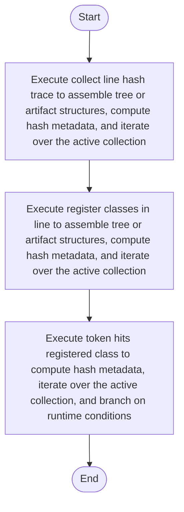

# registry.cpp

- Source: Microservice/Modules/Source/SyntacticBrokenAST/ParseTree/Internal/registry.cpp
- Kind: C++ implementation
- Lines: 143
- Role: Implements parsing, shadow-tree building, symbolization, hash linking, rendering, and reporting.
- Chronology: Runs across the middle of the microservice flow to build parse trees, hash links, symbol tables, reports, and rendered outputs.

## Notable Symbols
- register_classes_in_line
- token_hits_registered_class
- collect_line_hash_trace

## Direct Dependencies
- Internal/parse_tree_internal.hpp
- Language-and-Structure/language_tokens.hpp
- Language-and-Structure/lexical_structure_hooks.hpp
- functional
- string
- utility
- vector

## File Outline
### Responsibility

This source file implements one internal part of the generic parse-tree engine. It contributes specialized behavior such as code generation, dependency handling, symbolization, or hash-link construction after the raw tree exists. This source file implements one of the generic middle-stage services in the C++ pipeline. It is executed after sources are loaded and before the final report and rendered outputs are written.

### Position In The Flow

Runs across the middle of the microservice flow to build parse trees, hash links, symbol tables, reports, and rendered outputs.

### Main Surface Area

Implements parsing, shadow-tree building, symbolization, hash linking, rendering, and reporting. The main surface area is easiest to track through symbols such as register_classes_in_line, token_hits_registered_class, and collect_line_hash_trace. It collaborates directly with Internal/parse_tree_internal.hpp, Language-and-Structure/language_tokens.hpp, Language-and-Structure/lexical_structure_hooks.hpp, and functional.

## File Activity


## Function Walkthrough

### register_classes_in_line
This routine connects discovered items back into the broader model owned by the file. It appears near line 13.

Inside the body, it mainly handles assemble tree or artifact structures, compute hash metadata, iterate over the active collection, and branch on runtime conditions.

The implementation iterates over a collection or repeated workload. It branches on runtime conditions instead of following one fixed path.

Key operations:
- assemble tree or artifact structures
- compute hash metadata
- iterate over the active collection
- branch on runtime conditions

Activity:
```mermaid
flowchart TD
    Start([register_classes_in_line()])
    N0[Enter register_classes_in_line()]
    N1[Assemble tree or artifact structures]
    N2[Compute hash metadata]
    N3[Iterate over the active collection]
    N4[Branch on runtime conditions]
    N5[Hand control back to the caller]
    End([Return])
    Start --> N0
    N0 --> N1
    N1 --> N2
    N2 --> N3
    N3 --> N4
    N4 --> N5
    N5 --> End
```

### token_hits_registered_class
This routine owns one focused piece of the file's behavior. It appears near line 55.

Inside the body, it mainly handles compute hash metadata, iterate over the active collection, and branch on runtime conditions.

The implementation iterates over a collection or repeated workload. It branches on runtime conditions instead of following one fixed path. The caller receives a computed result or status from this step.

Key operations:
- compute hash metadata
- iterate over the active collection
- branch on runtime conditions

Activity:
```mermaid
flowchart TD
    Start([token_hits_registered_class()])
    N0[Enter token_hits_registered_class()]
    N1[Compute hash metadata]
    N2[Iterate over the active collection]
    N3[Branch on runtime conditions]
    N4[Return the result to the caller]
    End([Return])
    Start --> N0
    N0 --> N1
    N1 --> N2
    N2 --> N3
    N3 --> N4
    N4 --> End
```

### collect_line_hash_trace
This routine connects discovered items back into the broader model owned by the file. It appears near line 92.

Inside the body, it mainly handles assemble tree or artifact structures, compute hash metadata, iterate over the active collection, and branch on runtime conditions.

The implementation iterates over a collection or repeated workload. It branches on runtime conditions instead of following one fixed path. The caller receives a computed result or status from this step.

Key operations:
- assemble tree or artifact structures
- compute hash metadata
- iterate over the active collection
- branch on runtime conditions

Activity:
```mermaid
flowchart TD
    Start([collect_line_hash_trace()])
    N0[Enter collect_line_hash_trace()]
    N1[Assemble tree or artifact structures]
    N2[Compute hash metadata]
    N3[Iterate over the active collection]
    N4[Branch on runtime conditions]
    N5[Return the result to the caller]
    End([Return])
    Start --> N0
    N0 --> N1
    N1 --> N2
    N2 --> N3
    N3 --> N4
    N4 --> N5
    N5 --> End
```

## Documentation Note
- This markdown file is part of the generated docs/Codebase mirror.
- It was generated from the repository state on 2026-04-23 after reading the existing docs corpus and the current source tree.

