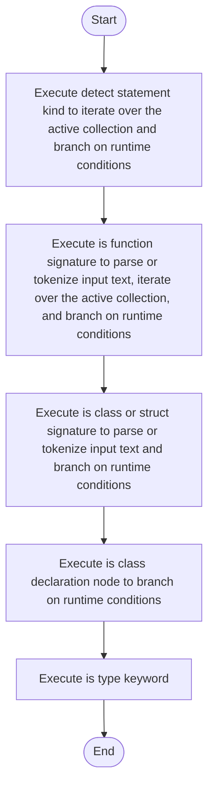

# statement.cpp

- Source: Microservice/Modules/Source/SyntacticBrokenAST/ParseTree/Internal/statement.cpp
- Kind: C++ implementation
- Lines: 149
- Role: Implements parsing, shadow-tree building, symbolization, hash linking, rendering, and reporting.
- Chronology: Runs across the middle of the microservice flow to build parse trees, hash links, symbol tables, reports, and rendered outputs.

## Notable Symbols
- is_type_keyword
- detect_statement_kind
- is_class_or_struct_signature
- is_function_signature
- is_class_declaration_node
- is_global_function_declaration_node

## Direct Dependencies
- Internal/parse_tree_internal.hpp
- language_tokens.hpp
- string
- vector

## Implementation Story
This source file implements one internal part of the generic parse-tree engine. It contributes specialized behavior such as code generation, dependency handling, symbolization, or hash-link construction after the raw tree exists. This source file implements one of the generic middle-stage services in the C++ pipeline. It is executed after sources are loaded and before the final report and rendered outputs are written.   Implements parsing, shadow-tree building, symbolization, hash linking, rendering, and reporting.   Runs across the middle of the microservice flow to build parse trees, hash links, symbol tables, reports, and rendered outputs.  The implementation surface is easiest to recognize through symbols such as is_type_keyword, detect_statement_kind, is_class_or_struct_signature, and is_function_signature.  In practice it collaborates directly with Internal/parse_tree_internal.hpp, language_tokens.hpp, string, and vector.

## Activity Diagram

## Documentation Note
- This markdown file is part of the generated docs/Codebase mirror.
- It was generated from the repository state on 2026-04-22 after reading the existing docs corpus and the current source tree.

