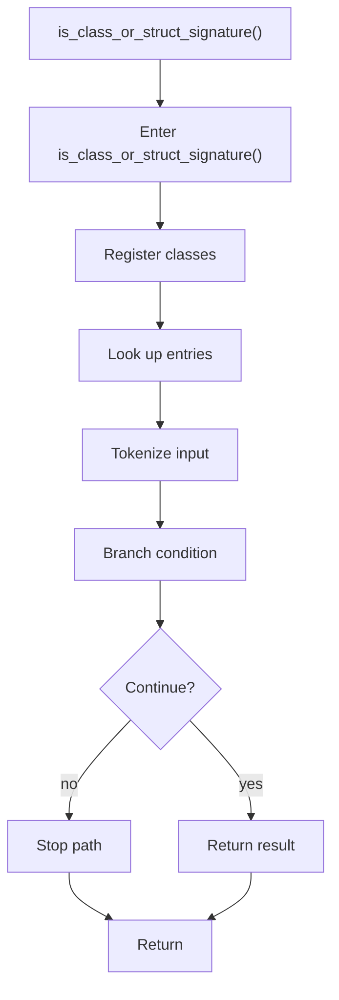

# is_class_or_struct_signature.cpp

- Source document: [statement.cpp.md](../../statement.cpp.md)
- Purpose: decoupled implementation logic for a future code unit.

### is_class_or_struct_signature()
This routine owns one focused piece of the file's behavior. It appears near line 79.

Inside the body, it mainly handles inspect or register class-level information, look up entries in previously collected maps or sets, parse or tokenize input text, and branch on runtime conditions.

It branches on runtime conditions instead of following one fixed path. The caller receives a computed result or status from this step.

What it does:
- inspect or register class-level information
- look up entries in previously collected maps or sets
- parse or tokenize input text
- branch on runtime conditions

Flow:

